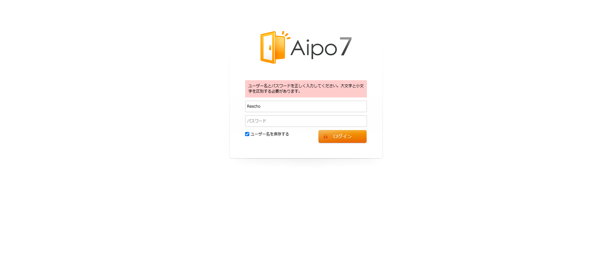

# 現行AIPOアプリケーション調査結果

調査日：2026-04-22

---

## 1. アプリケーション基本情報

| 項目 | 内容 |
|------|------|
| 製品名 | AIPO |
| バージョン | 7.0.2.0 |
| 開発元 | Aimluck Inc. |
| インストール日 | 2014年7月22日 |
| OSSリポジトリ | https://github.com/arkjun/aipo |

---

## 2. 技術スタック

### 言語・サーバー

| 項目 | 内容 |
|------|------|
| 言語 | Java |
| アプリケーションサーバー | Apache Tomcat（ポート80） |
| JRE | Windows用をバンドル同梱 |
| Tomcatヒープメモリ | -Xms1024m -Xmx1024m（固定1GB） |

### フレームワーク・ライブラリ

| 役割 | ライブラリ | バージョン |
|------|-----------|-----------|
| ポータル基盤 | Apache Jetspeed | - |
| ORM | Apache Cayenne | 2.0.4 / 3.0.1 |
| テンプレートエンジン | Apache Velocity | 1.3 |
| DI | Google Guice | 2.0 |
| 認証・セキュリティ | Apache Shiro | 1.0.0-incubating |
| ガジェット | Apache Shindig（OpenSocial） | 2.0.2 |
| キャッシュ | EhCache | 2.2.0 |
| ログ | Log4j | 1.2.x |
| ユーティリティ | Apache Commons 各種 | - |

### 依存管理

Maven/Gradleなし。JARを `WEB-INF/lib/` に手動配置する構成。全ライブラリが2010年前後のバージョンで固定されており、セキュリティパッチ未適用。

---

## 3. アーキテクチャ

### ポートレット構成

機能ごとに独立したJAR（`aipo-portlet-xxx.jar`）として分割。Apache Jetspeedがダッシュボード上に組み合わせて表示する。

| ポートレット | 機能 |
|------------|------|
| aipo-portlet-schedule | スケジュール |
| aipo-portlet-timecard | タイムカード |
| aipo-portlet-exttimecard | 拡張タイムカード |
| aipo-portlet-workflow | ワークフロー・稟議 |
| aipo-portlet-msgboard | 掲示板 |
| aipo-portlet-blog | ブログ |
| aipo-portlet-timeline | タイムライン |
| aipo-portlet-addressbook | アドレス帳 |
| aipo-portlet-facilities | 施設予約 |
| aipo-portlet-cabinet | ファイルキャビネット |
| aipo-portlet-webmail | Webメール |
| aipo-portlet-todo | ToDo |
| aipo-portlet-memo | メモ |
| aipo-portlet-report | レポート |
| aipo-portlet-manhour | 工数管理 |
| aipo-portlet-gadgets | ガジェット |
| aipo-portlet-account | アカウント管理 |
| aipo-portlet-accessctl | アクセス制御 |
| aipo-portlet-activity | アクティビティ |
| aipo-portlet-mygroup | マイグループ |

### レンダリング方式

サーバー側でHTMLを生成してブラウザに返すフルページリロード方式（SPA以前のアーキテクチャ）。ユーザー増加時のパフォーマンス問題の一因。

### デプロイ構成

JRE・PostgreSQL・Tomcatをすべてバンドルしたオールインワン構成。Windows専用バイナリのため他OSへの移植不可。

---

## 4. データベース

| 項目 | 内容 |
|------|------|
| 種類 | PostgreSQL |
| バージョン | 8.4.7（2014年EOL済み） |
| ビルド | Visual C++ 32bit Windows版 |
| ポート | 5432 |
| テーブル数 | 約80 |

### テーブル命名規則

| プレフィックス | 意味 |
|--------------|------|
| `eip_m_*` | マスターテーブル |
| `eip_t_*` | トランザクションテーブル |
| `turbine_*` | Turbineフレームワーク由来 |
| `jetspeed_*` | Jetspeedフレームワーク由来 |

### テーブル一覧

activity / activity_map / aipo_license / app_data / application / container_config / eip_facility_group / eip_m_address_group / eip_m_addressbook / eip_m_addressbook_company / eip_m_company / eip_m_config / eip_m_facility / eip_m_facility_group / eip_m_facility_group_map / eip_m_inactive_application / eip_m_mail_account / eip_m_mail_notify_conf / eip_m_position / eip_m_post / eip_m_user_position / eip_t_acl_map / eip_t_acl_portlet_feature / eip_t_acl_role / eip_t_acl_user_role_map / eip_t_addressbook_group_map / eip_t_blog / eip_t_blog_comment / eip_t_blog_entry / eip_t_blog_file / eip_t_blog_footmark_map / eip_t_blog_thema / eip_t_cabinet_file / eip_t_cabinet_folder / eip_t_cabinet_folder_map / eip_t_common_category / eip_t_eventlog / eip_t_ext_timecard / eip_t_ext_timecard_system / eip_t_ext_timecard_system_map / eip_t_mail / eip_t_mail_filter / eip_t_mail_folder / eip_t_memo / eip_t_msgboard_category / eip_t_msgboard_category_map / eip_t_msgboard_file / eip_t_msgboard_topic / eip_t_note / eip_t_note_map / eip_t_report / eip_t_report_file / eip_t_report_map / eip_t_report_member_map / eip_t_schedule / eip_t_schedule_map / eip_t_timecard / eip_t_timecard_settings / eip_t_timeline / eip_t_timeline_file / eip_t_timeline_like / eip_t_timeline_map / eip_t_timeline_url / eip_t_todo / eip_t_todo_category / eip_t_whatsnew / eip_t_workflow_category / eip_t_workflow_file / eip_t_workflow_request / eip_t_workflow_request_map / eip_t_workflow_route / jetspeed_group_profile / jetspeed_role_profile / jetspeed_user_profile / module_id / oauth_consumer / oauth_entry / oauth_token / turbine_group / turbine_permission / turbine_role / turbine_role_permission / turbine_user / turbine_user_group_role

### 主要テーブル カラム詳細

#### turbine_user（ユーザー）

| カラム | 型 |
|-------|---|
| user_id | integer |
| login_name | varchar(32) |
| password_value | varchar(200) |
| first_name / last_name | varchar(99) |
| first_name_kana / last_name_kana | varchar(99) |
| email | varchar(99) |
| cellular_mail / cellular_phone | varchar |
| in_telephone / out_telephone | varchar(15) |
| company_id / position_id | integer |
| photo | bytea（画像をDB直接格納） |
| objectdata | bytea（内容不明） |
| disabled | char(1) |
| last_login / created / modified | timestamp |

#### eip_t_schedule（スケジュール）

| カラム | 型 |
|-------|---|
| schedule_id | integer |
| name | varchar(99) |
| note | text |
| place | varchar(99) |
| start_date / end_date | timestamp |
| owner_id | integer |
| public_flag | varchar(1) |
| repeat_pattern | varchar(10) |
| parent_id | integer |
| edit_flag | varchar(1) |
| mail_flag | char(1) |
| create_date / update_date | date / timestamp |
| create_user_id / update_user_id | integer |

#### eip_t_schedule_map（スケジュール参加者）

| カラム | 型 |
|-------|---|
| id | integer |
| schedule_id | integer |
| user_id | integer |
| type | varchar(1) |
| status | varchar(1) |
| common_category_id | integer |

#### eip_t_timecard（タイムカード）

| カラム | 型 |
|-------|---|
| timecard_id | integer |
| user_id | integer |
| work_date | timestamp |
| work_flag | varchar(1) |
| reason | text |
| create_date / update_date | timestamp |

#### eip_t_workflow_request（ワークフロー申請）

| カラム | 型 |
|-------|---|
| request_id | integer |
| request_name | varchar(64) |
| note | text |
| category_id | integer |
| route_id | integer |
| user_id | integer |
| priority | smallint |
| progress | varchar(1) |
| price | bigint |
| parent_id | integer |
| create_date / update_date | timestamp |

#### eip_t_todo（ToDo）

| カラム | 型 |
|-------|---|
| todo_id | integer |
| todo_name | varchar(64) |
| note | text |
| category_id | integer |
| user_id | integer |
| priority | smallint |
| state | smallint |
| start_date / end_date | date |
| public_flag | varchar(1) |
| addon_schedule_flg | varchar(1) |
| create_date / update_date | date / timestamp |

### 特記事項

- `turbine_user.photo` が `bytea` → 画像をDBに直接保存。パフォーマンス問題の一因
- `turbine_user.objectdata` に用途不明のバイナリデータあり
- パスワードは `varchar(200)` 格納（ハッシュアルゴリズム不明。MD5の可能性あり）
- ファイル系テーブル（`eip_t_workflow_file` 等）にも `bytea` カラムあり

---

## 5. 画面スクリーンショット

### ログイン画面

**確認事項:**
- ユーザー名・パスワードの2項目のみ（シンプル構成）
- 「ユーザー名を保存する」チェックボックスあり
- 大文字・小文字を区別する旨のエラーメッセージ表示
- パスワードは大文字・小文字区別あり（ハッシュ化前の入力値に影響）

---

## 6. バックアップ

| 項目 | 内容 |
|------|------|
| 自動バックアップ | 毎日 3:30 実行 |
| 最終自動バックアップ | 2026-03-31 |
| 最終手動バックアップ | 2025-10-31 |
