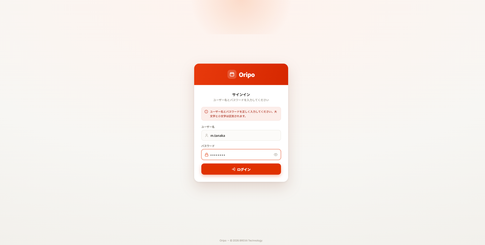
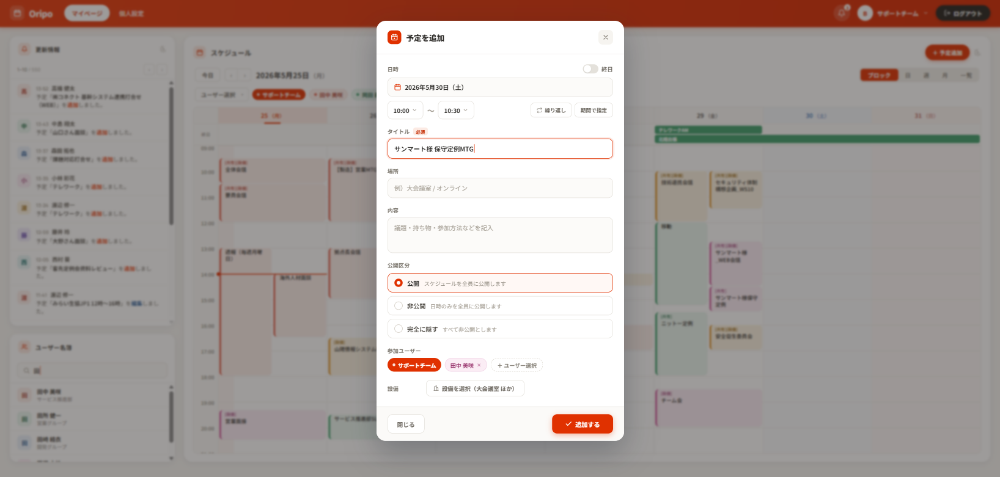
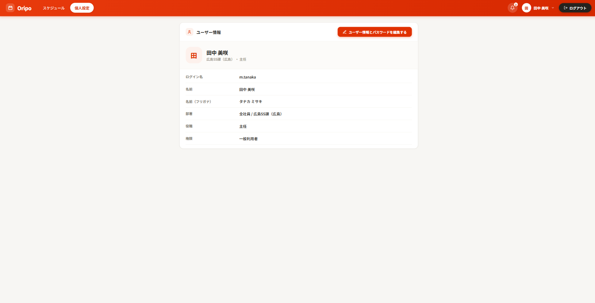
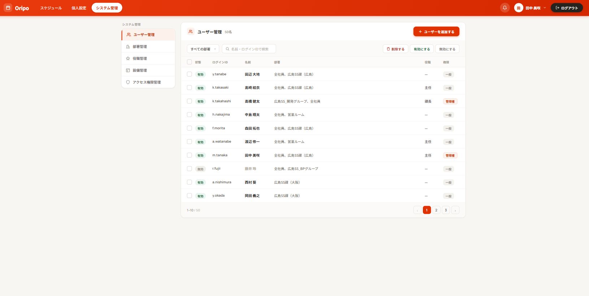
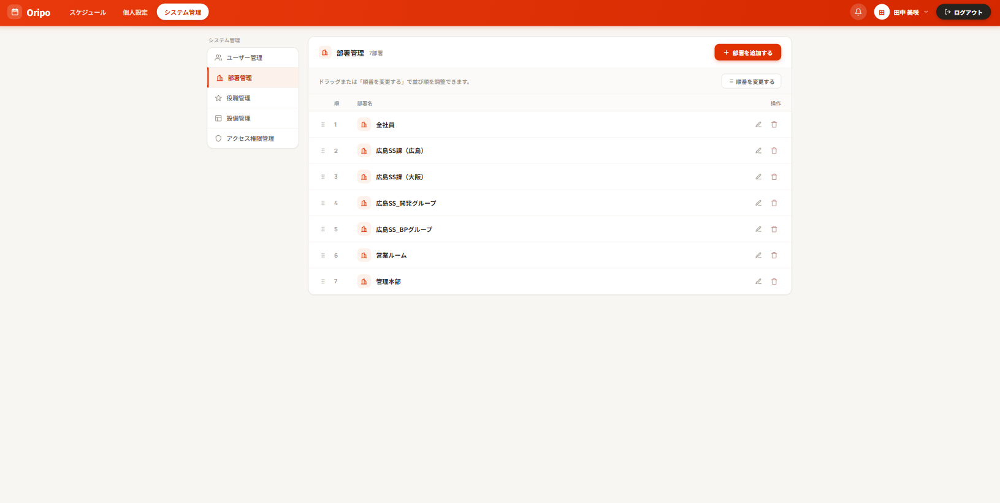
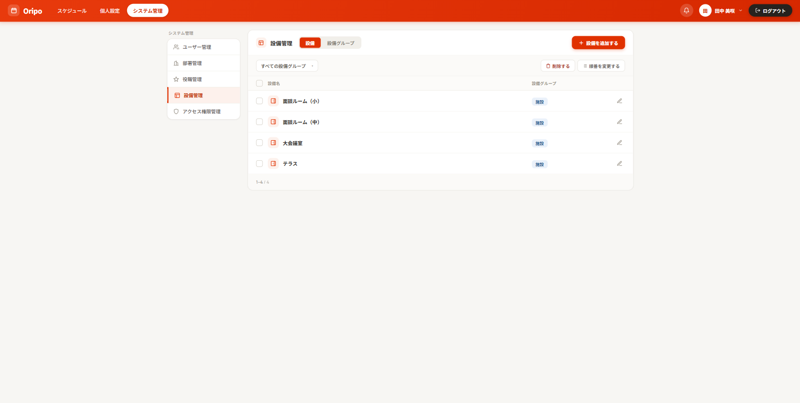
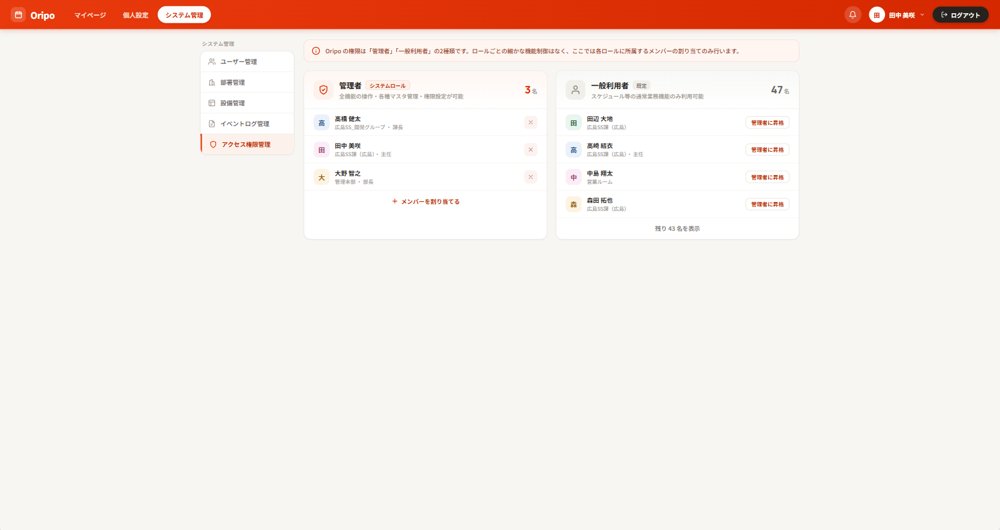
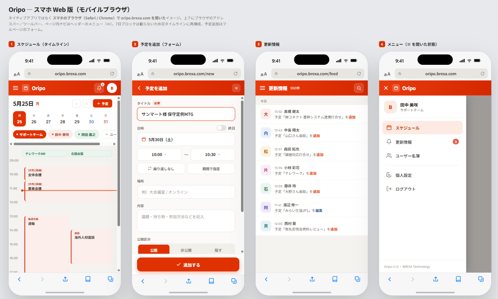

# 要件定義書

プロジェクト: Oripo（AIPO リプレース）
作成日: 2026-05-26
担当: y-teshima-ost
ステータス: **確定**（社内レビュー済み、2026-07-06）

---

## 1. はじめに

### 1.1 背景・目的

現行グループウェア AIPO（Java/Tomcat、導入から10年以上）の老朽化・保守困難を解消するため、Next.js ベースの新システム Oripo へ置き換える。

### 1.2 スコープ

現 AIPO から移行する機能（今フェーズの実装対象）:

| 機能 | 概要 |
|---|---|
| ログイン・認証 | ログインID・パスワードによる認証、セッション管理 |
| ホーム画面 | 各ウィジェットを配置するマイページ（レイアウト・タブカスタマイズ対応） |
| 更新情報（タイムライン） | 各機能の更新履歴を自動集約して一覧表示 |
| スケジュール | 個人・グループのスケジュール管理・設備予約 |
| ユーザー名簿 | 社内ユーザーのプロフィール閲覧 |
| 個人設定 | マイグループ管理など個人ごとの設定 |
| ユーザー情報管理 | 管理者によるユーザーアカウント・部署の管理 |
| イベントログ管理 | 管理者によるシステム操作ログの閲覧 |
| アクセス権限管理 | ロールによるアクセス制御 |

現 AIPO にある以下の機能は今フェーズのスコープ外:
- 掲示板、ブログ、共有 Todo、共有フォルダ、ワークフロー、報告書、アドレス帳、伝言メモ等

### 1.3 基本方針

#### ⚡ パフォーマンス
現行 AIPO の応答遅延・高負荷の課題を解消し、業務利用に十分な応答性能を確保する。

#### 🔒 セキュリティ
外部公開に十分なセキュリティ水準を確保する。認証・通信・アクセス制御を適切に設計する。

#### 🎨 モダンなデザイン
現行 AIPO から刷新し、使いやすく現代的な UI を提供する。

#### 💡 プライバシー方針
近年のプライバシーポリシーに配慮し、業務上必要な個人情報のみ保持する設計とする。メールアドレス等、Oripo では保持しない項目がある。電話番号（内線・外線・携帯）は業務上必要なため保持する。

#### 🔧 保守性及び拡張性
コードの可読性・変更容易性を維持し、長期的な保守を前提とした設計とする。今後の機能追加（AI エージェント連携等）にも対応できる構成とする。コードだけでなく仕様書・設計書も継続的に整備し、誰でも理解・改修できる状態を維持する。

#### 📚 スキルアップ
新入社員・待機社員のスキルアップ用教材としての活用も目的の一つ。モダンな技術スタックを採用しつつも構成はシンプルに保ち、コードを読み解きやすい設計とする。改良・保守を通じた技術習得を促進する。

### 1.4 用語定義

| 用語 | 説明 |
|---|---|
| AIPO | 現行グループウェア（Java/Tomcat製） |
| Oripo | 本プロジェクトで開発する新グループウェア |
| 管理者 | ユーザー管理・設定変更が可能なロール |
| 一般利用者 | 通常業務機能のみ利用可能なロール |

---

## 2. 機能要件

### 2.1 ログイン・認証

システムへの入口となる認証画面。

**要件:**
- ログインID・パスワードによる認証
- 認証失敗時のエラーメッセージ表示（大文字・小文字を区別する旨を含む）
- ログアウト機能
- セッション管理（サーバーサイド）
- セッションタイムアウト: 一定時間操作なしで自動ログアウト
- 未認証ユーザーはログイン画面にリダイレクト

**モックアップ:**

---

### 2.2 ホーム画面

ログイン後の起点となる画面。

**要件:**
- 2カラムレイアウト（左: 情報系ウィジェット、右: カレンダー系ウィジェット）
- 左カラム: 更新情報ウィジェット、ユーザー名簿検索ウィジェット
- 右カラム: スケジュール週表示ウィジェット
- 各ウィジェットから対応機能へのリンク
- マイ画面レイアウト: ウィジェットの表示/非表示・配置をユーザーが個別にカスタマイズできる
- タブ機能: マイページにタブを追加して複数のレイアウトを作成・切り替えられる

**モックアップ:**

---

### 2.3 更新情報（タイムライン）

各機能の更新履歴を自動集約して時系列で表示する読み取り専用フィード。

**要件:**
- ホーム画面左カラムにウィジェット表示（最新 N 件）
- 全件一覧ページ（アプリ別フィルタ・キーワード検索・ページング）
- 表示項目: 更新内容テキスト、更新者氏名、更新日時
- 各更新エントリから該当機能へリンク遷移
- 対象アプリ: スケジュール（将来的に他機能も追加可能な設計）
- 投稿・編集・削除は不可（閲覧専用）
- 全ログインユーザーが閲覧可能

**モックアップ:** 上記ホーム画面の左カラムに更新情報ウィジェットが表示されている。

---

### 2.4 スケジュール

個人・グループのスケジュール管理と設備（会議室等）の予約。

**要件:**
- 日・週・月の表示切替
- 複数ユーザーの予定を横並び比較表示（全員スケジュール）
  - 最大表示人数: 30人（AIPO に準拠）
- スケジュールの登録・編集・削除
  - 件名、開始/終了日時、場所、メモ、公開/非公開フラグ
  - 参加ユーザーの選択（グループ・個人）
  - 繰り返し設定（毎日・毎週・毎月等）
- 設備（会議室等）の予約と空き確認
  - 空き状況がひと目でわかる表示
  - 空いていない時間帯は選択不可
- 祝日の自動反映
- アクセス制御: 管理者ロールのみ他ユーザーの予定を編集可

**モックアップ:**

---

### 2.5 ユーザー名簿

社内ユーザーのプロフィール一覧を閲覧する機能。

**要件:**
- ホーム画面にキーワード検索ボックスのみのコンパクトウィジェット表示
- 全件一覧: 氏名リスト + キーワード検索 + ページング
- 絞り込み: 部署・グループ・キーワード（氏名部分一致）
- 表示項目: 氏名、部署、グループ、役職、内線番号、電話番号、携帯電話番号
- 閲覧専用（編集はユーザー情報管理で行う）
- スマホ版では電話番号から直接発信可能（`tel:` リンク）

**モックアップ:**

---

### 2.6 ユーザー情報管理

管理者がユーザーアカウントを管理する機能。

**要件:**
- ユーザー一覧（部署フィルタ、ページング）
- ユーザーの有効/無効切り替え（退職者対応）
- ユーザーの新規作成・編集・削除
  - 登録項目: ログインID（変更不可）、パスワード、姓・名、部署（複数選択可）、役職、内線番号、電話番号、携帯電話番号、管理者権限フラグ
  - パスワードは AIPO と同アルゴリズムで保存。移行時にそのままコピーするためパスワード変更不要
- 部署マスタ管理（追加・編集・削除・並び順変更）
- 管理者権限を持つユーザーのみ操作可能

**モックアップ:**

---

### 2.7 個人設定

ユーザーが自身の環境をカスタマイズする機能。

**要件:**
- ページ設定（タブ管理）
  - マイページを複数作成・編集・削除・並び順変更できる
  - デフォルトで「マイページ」が1つ存在する
- マイグループ管理
  - 任意のユーザーをまとめたグループを作成・編集・削除できる
  - スケジュール（全員スケジュール）・ユーザー名簿の絞り込みに利用できる
  - 自分だけが参照できる（他ユーザーには非公開）

**モックアップ:**

---

### 2.8 イベントログ管理

管理者がシステムの操作ログを閲覧・管理する機能。

**要件:**
- 管理者権限を持つユーザーのみ操作可能
- 表示項目: 操作日時、操作ユーザー、機能名、操作種別（色付きバッジ表示）、接続IP
- 一覧表示（ページング、50件/ページ）
- フィルタ: 期間指定
- 選択したログの削除
- 選択期間のログを CSV ダウンロード

**モックアップ:**

---

### 2.9 設備マスタ管理

設備（会議室等）のマスタ管理。管理者のみ操作可能。

**要件:**
- 設備の追加・編集・削除
- 設備グループの管理
- 管理者権限を持つユーザーのみ操作可能

**モックアップ:**

---

### 2.10 アクセス権限管理

シンプルなロールベースのアクセス制御。

> 💬 **方針**: AIPO の細かすぎる権限設定は現場で使われていない可能性が高いため、シンプルな2ロール構成を基本とする。現 AIPO の実際のロール設定を確認した上で最終決定する。

**ロール構成（案）:**

| ロール | 権限 |
|---|---|
| 管理者 | 通常業務機能 + システム管理（ユーザー・部署・設備・権限・イベントログの管理） |
| 一般利用者 | 通常業務機能（スケジュール・更新情報等）の利用 |

**モックアップ:**

---

### 2.11 モバイル対応

スマートフォンのブラウザからも主要機能が利用できること。

**要件:**
- スケジュール閲覧・予定の登録・編集
- 更新情報の閲覧
- ユーザー名簿の電話番号から直接発信（`tel:` リンク）
- ナビゲーションメニュー（ハンバーガーメニュー）
- PC 版と同一 URL・同一コードベース（レスポンシブデザイン）

**モックアップ:**

---

## 3. 非機能要件

### 3.1 外部公開・アクセス

- 外部公開: 必須（現 AIPO が既に外部公開済みのため）
- アクセス方法: CDN（Cloudflare、無料プラン）経由で公開
- ドメイン: Cloudflare で取得予定（年間 $10 程度）、ドメイン名は要確認
- スマホ対応: レスポンシブデザイン対応

### 3.2 セキュリティ

- 認証: セッション管理（サーバーサイド）
- 通信: HTTPS（CDN が自動提供）
- パスワード: AIPO と同アルゴリズム（SHA-1 + Base64）で保存、移行時はそのままコピー
- アクセス制御: ロールベース（2ロール構成）
- XSS・CSRF・SQLインジェクション対策
- ホストサーバーのファイアウォール・ポート管理（不要なポートは閉じる）
- WAF 導入は要検討（複雑化するため現時点では保留）
- 実行プロセス: 全て非ルートユーザーで実行（コンテナ内も含む）
- パスワードポリシー: 新規設定・変更時は8文字以上。移行ユーザーは既存パスワードをそのまま使用

### 3.3 サーバー・インフラ

- OS: Ubuntu Server 18
- コンテナ: Docker / docker compose（将来のサーバー移行を考慮してコンテナ化）
- イメージレジストリ: GitHub Container Registry（GHCR）
- 想定スペック（目安）:
  - メモリ: 4GB 以上（現行7GBから削減　現在の同時利用規模では 2GB で動作するが、機能拡張を見据えて 4GB 推奨）
  - ストレージ: 50GB 以上（DB・ログ・バックアップ含む）

### 3.4 データベース

- DB: PostgreSQL
- バックアップ: 1日1回、コンテナ外にダンプファイルを保存、最大1ヶ月分保持

### 3.5 パフォーマンス

- 一覧ページのロード: 3秒以内（通常回線）
- 登録ユーザー数: 約200名
- 同時接続ユーザー: 平常時30名、最大300名を想定（ユーザー数200名に対し1.5倍のバッファ）
- 負荷テスト: 最大300・1000同時接続での動作確認を実施予定
- ページング: 一覧は20〜30件/ページ

### 3.6 対応環境

- ブラウザ: Chrome 最新版、Edge 最新版
- デバイス: PC（必須）、スマートフォン（レスポンシブ対応、詳細は 2.11 参照）

### 3.7 ログ管理

- アクセスログ: リクエスト・レスポンスをアプリケーションレベルで記録
- エラーログ: アプリケーションエラー・例外を記録
- 保持期間: 1ヶ月
- コンテナログは `docker compose logs` で参照可能

---

## 4. 制約・前提条件

### 4.1 データ移行

- スケジュール等のデータは AIPO から移行する方針
- **メールアドレス等、業務上不要な個人情報は移行しない**
- 電話番号（内線・外線・携帯）は業務上必要なため移行する
- 古いスケジュールレコード（３年以上前）は移行しない方針
- パスワードはそのままコピー（ユーザーへの通知・変更不要）
- 移行の詳細は Phase 7（移行フェーズ）で別途計画

### 4.2 開発・運用

- 実装: Next.js 15 / TypeScript / App Router（TypeScript により型安全性・保守性を確保）
- CI/CD: GitHub Actions（ユニットテスト自動実行、main マージで GHCR へイメージ push）
- テスト: Vitest（ユニット）、最終確認は人間が手動で実施（仕様書の受け入れ条件をチェックリストとして使用）
- デプロイ所要時間: 1分以内（コンテナ入れ替え方式）、ダウンタイム 10秒以内
- ドキュメント: 仕様書・設計書・運用手順を常に最新状態に保ち、コードを読まなくてもシステムを理解できる体制を目指す

---

## 5. 今後の拡張方針

- 追加機能は今後検討
- AI エージェント連携（将来的に実装予定）
