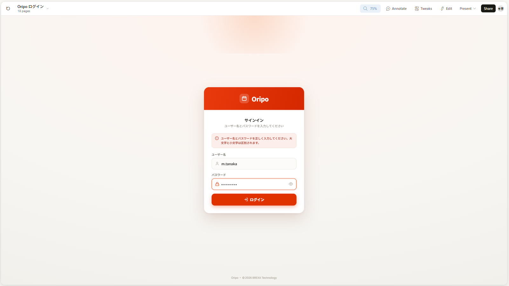

# ログイン画面

## 概要

システムへの入口となる認証画面。ユーザー名とパスワードで認証し、セッションを発行する。

AIPO 準拠: `JLoginUser.doPerform()` の動作に合わせる。

## モックアップ

## 機能要件

### 画面

- ページタイトル: `Oripo`（ブラウザタブ）
- ヘッダー: Oripo ロゴ（カレンダーアイコン + "Oripo"）、赤背景
- フォームタイトル: 「サインイン」
- サブタイトル: 「ユーザー名とパスワードを入力してください」
- フッター: 「Oripo · © 2026 BREXA Technology」

### フォーム

| フィールド | 種別 | 説明 |
|---|---|---|
| ユーザー名 | text | `turbine_user.login_name` に対応。`autocomplete="username"` を付与 |
| パスワード | password | 表示/非表示トグル（目のアイコン）あり。`autocomplete="current-password"` を付与 |
| ログインボタン | submit | - |

### 認証ロジック

1. ロックアウト確認: 対象ユーザーが10分以内に5回失敗済み → ロックアウトエラーを返す
2. ユーザー名で `turbine_user` を検索
3. 入力パスワードを SHA-1 + Base64 でハッシュ化し `password_value` と比較（大文字・小文字を区別）
4. 認証成功かつ `disabled = 'T'` → 無効アカウントエラーを表示
5. 認証成功かつ `disabled` が `'T'` 以外 → 失敗カウンターをリセット → セッション発行 → ホームへリダイレクト
6. 認証失敗（ユーザー不存在 or パスワード不一致）→ 失敗カウンターをインクリメント → 失敗エラーを表示

**ロックアウト仕様:**
- 管理単位: ユーザー名（存在しないユーザー名も対象）
- 閾値: 10分以内に5回失敗
- ロック時間: 10分（経過後に自動解除）
- 管理方式: メモリ内（サーバー再起動でリセット）

### レスポンシブ対応

| ブレークポイント | 挙動 |
|---|---|
| 全画面幅共通 | カードは中央配置・最大幅 340px・両サイドに最低 16px の余白 |
| モバイル（< 640px）| カードが利用可能幅いっぱいに広がる（最大 340px 以内） |

**iOS 入力ズーム防止**: フォームの `<input>` はフォントサイズを 16px 以上にする（それ未満だと iOS Safari が入力時に自動ズームする）。

### バリデーション

| フィールド | ルール | 備考 |
|---|---|---|
| ユーザー名 | 最大50文字 | AIPO準拠 |
| ユーザー名 | 半角英数のみ（IME無効） | AIPO準拠（`ime-mode:disabled`相当）。`inputmode="email"` で代替 |
| パスワード | 最大50文字 | AIPO準拠 |
| パスワード | 半角英数のみ（IME無効） | AIPO準拠 |
| 空送信 | クライアントサイドチェックなし。サーバー側で認証失敗として処理 | AIPO準拠 |

### エラーメッセージ

| 状況 | メッセージ |
|---|---|
| 認証失敗 | 「ユーザー名とパスワードを正しく入力してください。大文字と小文字は区別されます。」 |
| アカウント無効 | 「このアカウントは無効です。管理者に連絡してください。」 |
| ロックアウト中 | 「ログイン試行が上限を超えました。しばらく待ってから再度お試しください。」 |

> **AIPO との差異**:
> - AIPO のロックアウトは「5分以内に3回失敗、または累計10回失敗でサーバー再起動まで永久ロック」。
> - Oripo は「10分以内に5回失敗 → 10分ロック（自動解除）」とする。永久ロックは運用上厳しすぎるため採用しない。
> - ロック状態はメモリ管理（AIPO準拠）。サーバー再起動でリセットされる。

### セッション・リダイレクト

- セッション方式: iron-session（Cookie、AES暗号化）
- Cookie有効期限: 8時間（ログインから）
- セッション内容: `userId`、`loginName`
- 認証済みユーザーが `/login` にアクセス → ホーム（`/`）へリダイレクト
- 未認証ユーザーが保護ページにアクセス → `/login?redirect={元のパス}` へリダイレクト（AIPO準拠）
- ログイン成功時: `redirect` パラメータがあればそのパスへ、なければ `/` へリダイレクト
- ログアウト: Cookie を削除してログイン画面へリダイレクト

### DB への影響

- ログイン成功時: `turbine_user.last_login` を現在時刻で更新（AIPO 準拠）

## API

Route Handler は使用しない（実装規約: 外部連携がない場合は Server Action を使う）。

### Server Actions（`src/app/login/actions.ts`）

#### `login(loginName, password)`

| 状況 | 戻り値 |
|---|---|
| 成功 | `{ ok: true }` |
| 認証失敗 | `{ ok: false, error: "invalid_credentials" }` |
| アカウント無効 | `{ ok: false, error: "account_disabled" }` |
| ロックアウト中 | `{ ok: false, error: "locked_out" }` |

成功時: セッションCookieを発行し `turbine_user.last_login` を更新する。

#### `logout()`

セッションCookieを削除する。

## データモデル

### 参照テーブル

**`turbine_user`**（既存・変更なし）

| カラム | 用途 |
|---|---|
| `login_name` | ユーザー名照合 |
| `password_value` | SHA-1+Base64 ハッシュ照合 |
| `disabled` | `'T'` = 無効アカウント |
| `last_login` | ログイン成功時に更新 |
| `user_id` | セッションに格納するID |

**`oripo_sessions`**（新規・Phase 1 では未使用）

iron-session（Cookie方式）を採用するため Phase 1 では使用しない。Phase 2（DB セッション方式移行時）に使用予定。

## 受け入れ条件

- [ ] 正しいユーザー名・パスワードを入力してログインボタンを押すと、ホーム画面へ遷移する
- [ ] 誤ったパスワードを入力するとエラーメッセージが表示され、画面はログインのままである
- [ ] 存在しないユーザー名を入力すると同様のエラーメッセージが表示される（ユーザー名の存在をユーザーに推測させない）
- [ ] `disabled = 'T'` のユーザーが正しい認証情報を入力すると、無効アカウントのエラーが表示される
- [ ] パスワードフィールドの目のアイコンを押すと、パスワードが表示/非表示切り替えできる
- [ ] ログイン成功時に `turbine_user.last_login` が更新される
- [ ] 未認証状態でホーム画面（`/`）にアクセスすると `/login?redirect=/` へリダイレクトされる
- [ ] ログイン成功後、`redirect` パラメータのページへ戻る（セッションタイムアウト後の再ログインでも元のページに戻れる）
- [ ] 認証済み状態で `/login` にアクセスすると `/` へリダイレクトされる
- [ ] ログアウト後は `/login` に戻り、戻るボタンでも認証済みページにアクセスできない
- [ ] パスワードは大文字・小文字を区別して照合される
- [ ] ユーザー名は大文字・小文字を区別して照合される（例: `Tanaka` と `tanaka` は別ユーザー）
- [ ] 10分以内に5回認証失敗するとロックアウトエラーが表示され、それ以上ログインできなくなる
- [ ] ロックアウトから10分経過後は再度ログインを試みることができる
- [ ] 存在しないユーザー名への連続失敗もロックアウトのカウント対象となる
