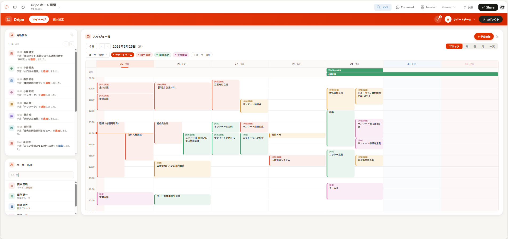
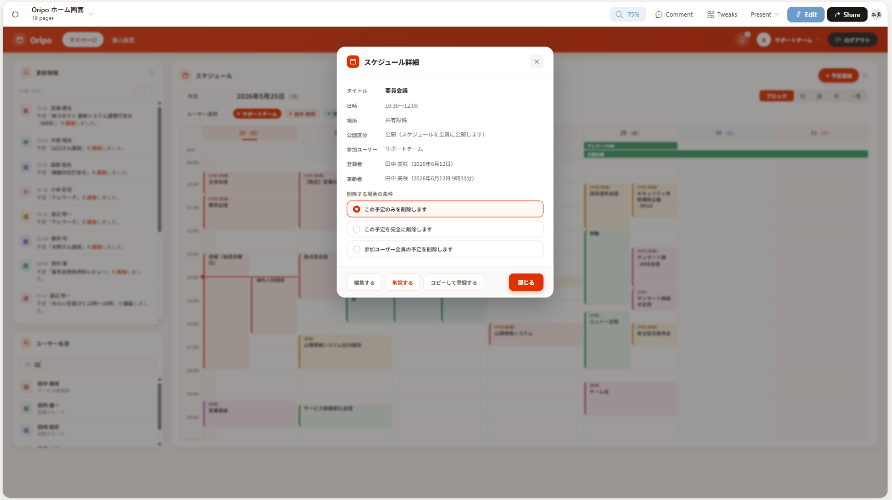

# スケジュールウィジェット

## 概要

ホーム画面に表示するスケジュール管理ウィジェット。個人の予定を週カレンダー形式で表示・管理する。

AIPO 準拠: `portlets/schedule`（週表示ウィジェット）に相当。

### フェーズ分割

| フェーズ | Issue | 内容 | 状態 |
|---|---|---|---|
| **A（本 Issue）** | #81 | 週表示・自分のみ・予定 CRUD（繰り返しなし） | 実装中 |
| B | 子 Issue | マルチユーザー表示・ユーザー選択 | 未着手 |
| C | 子 Issue | 繰り返し予定の作成・編集 | 未着手 |
| D | 子 Issue | 設備予約・日/月/一覧ビュー | 未着手 |

---

## モックアップ

**デスクトップ:**


**スケジュール詳細モーダル:**


**モバイル（スマホ Web 版）:**


**AIPO 現行スクリーンショット（参考）:**
- スケジュール詳細モーダル: `docs/01_current/screenshots/04b_schedule-detail-modal.png`

---

## 機能要件（Phase A）

### 週カレンダー表示

- 月曜始まりで当週の7日間（月〜日）を列表示する
- 時刻軸は 00:00〜24:00。デフォルトスクロール位置は 08:00 付近
- 表示対象: ログインユーザー自身が参加者（`eip_t_schedule_map.user_id`）の予定
- **通常予定**（`repeat_pattern = 'N'`）: 時刻グリッド内にブロック表示
- **終日予定**（`repeat_pattern = 'S'`）: 各日列の上部に帯で表示
- 繰り返し予定の**表示**: 既に DB に子レコードとして展開済みのため通常予定と同様に取得・表示する（Phase A で作成はしない）

### ナビゲーション

- `今日` ボタン: 当週に戻る
- `◀` / `▶` ボタン: 前週・翌週に移動
- ヘッダーに `YYYY年MM月DD日（曜日）` 形式で週の開始日を表示
- 表示モードボタン（ブロック / 日 / 週 / 月 / 一覧）: Phase A は「週」のみ動作。他は非活性で表示のみ
- **祝日表示**: 日付列ヘッダーの土日を色分け表示する（土=青、日/祝=赤）。祝日名を赤字でヘッダーに表示する（`src/lib/holidays.ts` の静的マップで 2025〜2026 年対応）。
  - **要件定義書 2.4 準拠**（「祝日の自動反映」が明記されている）。Phase A は静的マップで暫定実装。外部 API 連携は将来フェーズで対応。

### 予定追加

- `+予定追加` ボタン → 追加モーダルを開く
- 追加フォームのフィールド:

| フィールド | 内容 | 必須 |
|---|---|---|
| タイトル | `name`（最大 99 文字） | ○ |
| 終日 | チェックON で `repeat_pattern = 'S'`、OFF で `= 'N'` | - |
| 日付 | `start_date`（終日 ON 時は日付のみ） | ○ |
| 開始時刻 | `start_date`（終日 OFF 時） | ○ |
| 終了時刻 | `end_date`（終日 OFF 時） | ○ |
| 場所 | `place`（最大 99 文字） | - |
| 内容 | `note` | - |
| 公開区分 | `public_flag`: 公開(O) / 非公開(P) / 完全に隠す(C) | ○ |

- フォームレイアウト（スマホモックアップ準拠）:
  - タイトル → 終日トグル → 日時 → **「繰り返しなし」ボタン**（クリック時は "Phase C で実装予定" のトースト表示） → 場所 → 内容 → 公開区分（3択トグル）→ 追加ボタン
  - 参加ユーザー選択は Phase B で対応

- AIPO 準拠のデフォルト値:
  - `public_flag = 'O'`（公開）
  - `edit_flag = 'T'`（編集可）
  - `mail_flag = 'N'`（通知なし）
  - `parent_id = 0`（繰り返しなし）
  - `owner_id = create_user_id = update_user_id = loginUserId`
  - 作成者自身が `eip_t_schedule_map` に `type='U'`, `status='O'`（オーナー）で登録される

### 予定詳細・編集・削除

- スケジュールブロッククリック → 詳細モーダル（タイトル・日時・場所・内容・公開区分）
- 詳細モーダルから「編集」→ 編集フォーム（追加フォームと同構成）
- 削除は確認ダイアログ後に `eip_t_schedule` と `eip_t_schedule_map` の両方を削除
- 自分が `owner_id` でない予定は編集・削除不可（AIPO 準拠）
  - ただし管理者ロールは他ユーザーの予定も編集可（Phase A では管理者判定はスキップ）

### 繰り返し予定（既存データ）の閲覧

- 繰り返し子レコード（`parent_id > 0`）はカレンダー上に通常予定と同様に表示する
- クリックすると詳細モーダルが開くが、**編集・削除ボタンを非表示**にする
  - 理由: 繰り返し予定の編集は「この予定のみ / 以降すべて / 全て」の選択が必要で Phase C で実装
- 詳細モーダルに「繰り返し予定です（編集は Phase C で対応予定）」を表示する

### スケジュールブロックの表示

- ブロックに表示: タイトル（省略あり）・時刻
- 色分け（Phase A）: `public_flag` による
  - `O`（公開）: ブランドカラー系
  - `P`（非公開）: グレー系
  - `C`（完全非公開）: ダークグレー系
- 終日予定は帯の中にタイトルのみ表示
- 重複予定（同時刻帯に複数）: 横並びで幅を分割表示

### レスポンシブ対応

スマホモックアップ（`スマホWEB版.png`）準拠。

| ブレークポイント | 挙動 |
|---|---|
| デスクトップ（lg 以上） | 7列の週表示 |
| モバイル（lg 未満） | 7列の横スクロール週表示。時刻軸は固定、日付列を横スクロール |

---

## API

### Server Actions（`src/app/(main)/actions.ts`）

```ts
// 指定週のスケジュール取得（自分のみ）。userId は requireAuth() 内部で取得。
getWeekSchedulesAction(weekStart: string): Promise<ScheduleEntry[]>

// スケジュール詳細取得（登録者・更新者・参加ユーザー）。詳細モーダルを開いたタイミングで呼ぶ。
getScheduleDetailAction(scheduleId: number): Promise<ScheduleDetail>

// 予定追加
addScheduleAction(data: ScheduleInput): Promise<ScheduleEntry>

// 予定更新
updateScheduleAction(scheduleId: number, data: ScheduleInput): Promise<ScheduleEntry>

// 予定削除（eip_t_schedule + eip_t_schedule_map）
deleteScheduleAction(scheduleId: number): Promise<void>
```

### DB クエリ（`src/lib/schedule.ts`）

```ts
// 週表示クエリ: 指定ユーザーの日付範囲の予定を取得
// タイムゾーン注意: DBはAsia/TokyoのJSTで格納。Kyselyでは start_date::text で読み取り文字列としてパースする
getWeekSchedules(userId: number, from: Date, to: Date): Promise<ScheduleEntry[]>
```

---

## データモデル

### 既存テーブル（AIPO DB）

**`eip_t_schedule`（スケジュール本体）**

| カラム | 型 | 説明 |
|---|---|---|
| `schedule_id` | integer | PK |
| `name` | varchar(99) | タイトル（必須） |
| `note` | text | 内容 |
| `place` | varchar(99) | 場所 |
| `start_date` | timestamp | 開始日時（JST で格納） |
| `end_date` | timestamp | 終了日時（JST で格納） |
| `public_flag` | varchar(1) | O=公開 / P=非公開 / C=完全非公開 |
| `repeat_pattern` | varchar(10) | N=繰り返しなし / S=終日 / DL,DN=毎日 / W0111110L=週次 / M15N=月次 |
| `parent_id` | integer | 0=単独予定（繰り返し子の場合は親 schedule_id） |
| `edit_flag` | varchar(1) | T=編集可 / F=編集不可 |
| `mail_flag` | char(1) | N=通知なし（Phase A では常に N） |
| `owner_id` | integer | 作成者 user_id |
| `create_user_id` | integer | 登録者 user_id |
| `update_user_id` | integer | 最終更新者 user_id |
| `create_date` | date | 登録日 |
| `update_date` | timestamp | 更新日時 |

**`eip_t_schedule_map`（参加者マッピング）**

| カラム | 型 | 説明 |
|---|---|---|
| `id` | integer | PK（シーケンス採番） |
| `schedule_id` | integer | FK → eip_t_schedule |
| `user_id` | integer | 参加者 user_id（type='U'）または設備 ID（type='F'） |
| `type` | varchar(1) | U=ユーザー / F=設備 |
| `status` | varchar(1) | O=オーナー / T=参加確認済み / R=保留 / D=削除 / C=キャンセル |
| `common_category_id` | integer | カテゴリ（Phase A では 1 固定 ※ FK制約で eip_t_common_category の唯一の値が 1） |

### PK 採番（重要）

`eip_t_schedule.schedule_id` と `eip_t_schedule_map.id` はカラムに DEFAULT がない。AIPO は独自シーケンスで採番する。

```sql
-- INSERT 時に使用するシーケンス
nextval('pk_eip_t_schedule')      -- schedule_id
nextval('pk_eip_t_schedule_map')  -- id
```

Kysely での INSERT 例:
```ts
const { schedule_id } = await db
  .selectFrom(sql`nextval('pk_eip_t_schedule') as schedule_id`.as('t'))
  .selectAll()
  .executeTakeFirstOrThrow()
```

### タイムゾーンの扱い（重要）

- DB の timezone は `Asia/Tokyo`。`timestamp without time zone` カラムに JST のまま格納されている
- Node.js の pg クライアントは `timestamp without time zone` を UTC として扱うためズレが生じる
- **対策**: Kysely で取得する際は `sql\`start_date::text\`` で文字列として読み取り、JST 文字列として Date に変換する

```ts
// 正しい変換: "2026-07-22 14:00:00" を JST として扱う
function parseJstString(str: string): Date {
  // "YYYY-MM-DD HH:MM:SS" → JST として解釈し UTC の Date を返す
  return new Date(str.replace(' ', 'T') + '+09:00')
}
```

### 型定義（`src/lib/schedule.types.ts`）

```ts
export type ScheduleEntry = {
  scheduleId: number
  name: string
  note: string | null
  place: string | null
  startDate: Date       // UTC に正規化済み
  endDate: Date         // UTC に正規化済み
  publicFlag: 'O' | 'P' | 'C'
  repeatPattern: string // 'N' | 'S' | ...
  isAllDay: boolean     // repeatPattern === 'S'
  parentId: number      // 0=単独予定 / >0=繰り返し子レコードの親 schedule_id
  isOwner: boolean      // ownerId === loginUserId
  ownerId: number
}

export type ScheduleInput = {
  name: string
  note?: string
  place?: string
  startDate: Date
  endDate: Date
  isAllDay: boolean
  publicFlag: 'O' | 'P' | 'C'
}
```

---

## 受け入れ条件

### 表示

- [ ] 当週（月〜日）の7列週カレンダーが表示される
- [ ] 自分が参加者の通常予定（repeat_pattern='N'）が時刻グリッドに表示される
- [ ] 終日予定（repeat_pattern='S'）が日付列上部の帯に表示される
- [ ] 繰り返し予定（既存 DB データ）が正しい日付・時刻で表示される
- [ ] `今日` ボタンで当週に戻れる
- [ ] `◀` `▶` で前週・翌週に移動できる

### 予定追加

- [ ] `+予定追加` ボタンから追加モーダルが開く
- [ ] タイトル・日時・場所・内容・公開区分を入力して保存できる
- [ ] 「終日」チェックON で時刻入力が非表示になる
- [ ] 保存後、カレンダーに即時反映される
- [ ] タイトル未入力でバリデーションエラーが表示される
- [ ] 終了時刻が開始時刻より前の場合バリデーションエラーが表示される

### 予定詳細モーダル

- [ ] ブロッククリックで詳細モーダルが開く
- [ ] モーダルにタイトル・日時・場所・内容・公開区分が表示される
- [ ] モーダルに参加ユーザー・登録者（名前＋日付）・更新者（名前＋日時）が表示される
- [ ] 自分が owner の場合、削除する場合の条件（この予定のみ / 完全に削除 / 参加ユーザー全員）をラジオで選択できる
- [ ] 「編集する」「削除する」「コピーして登録する」「閉じる」ボタンが表示される（owner のみ最初の3つ）
- [ ] 他ユーザーが owner の予定は「閉じる」ボタンのみ表示される
- [ ] 編集・削除後にカレンダーが即時更新される

### 繰り返し予定

- [ ] 繰り返し予定（parent_id > 0）が正しい日付でカレンダーに表示される
- [ ] 繰り返し予定の詳細モーダルに編集・削除ボタンが表示されない
- [ ] 予定追加フォームに「繰り返しなし」ボタンが表示される（クリック時は未実装メッセージ）

### タイムゾーン

- [ ] 予定の時刻が JST として正しく表示される（例: DB 値 "14:00" → 画面表示 "14:00"）
- [ ] 終日予定が正しい日付に表示される（例: DB 値 "2026-07-22 00:00:00 JST" → 7月22日の帯）

### レスポンシブ

- [ ] モバイル（375px）でカレンダーがスクロール可能で表示される
