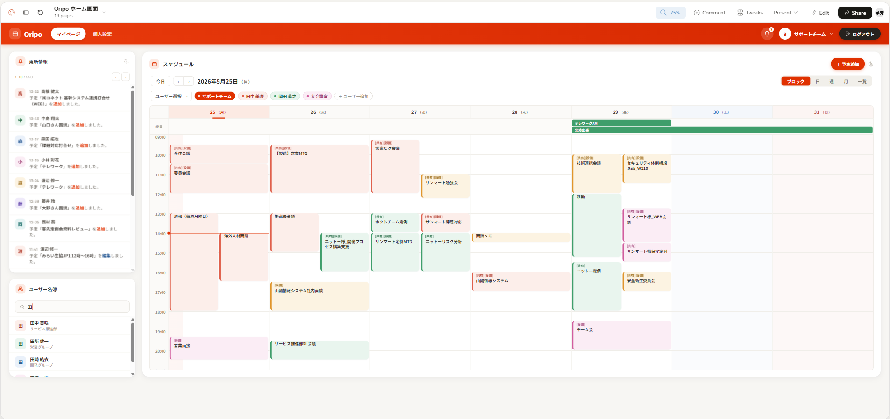
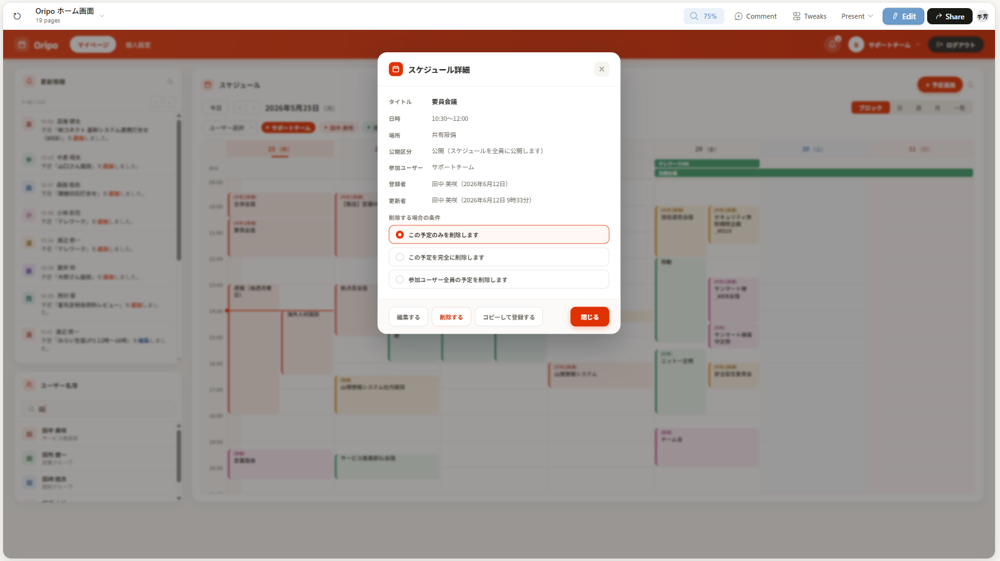
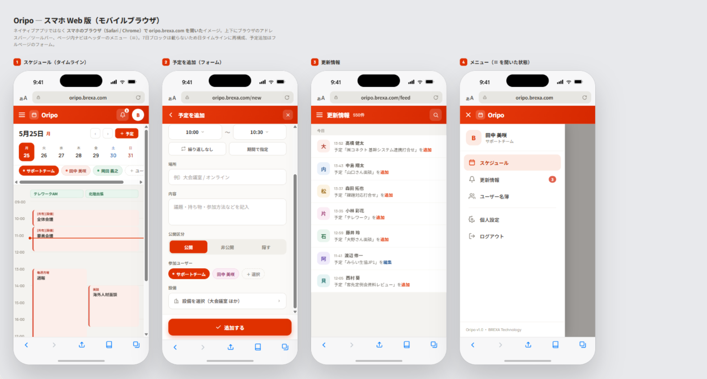

# スケジュールウィジェット

## 概要

ホーム画面（マイページ）に配置するスケジュール管理ウィジェット。自分やグループの予定を、ブロック（時刻グリッド）・週テーブル・日・月・一覧の各ビューで表示し、予定の登録・編集・削除、繰り返し予定、設備予約を行う。

- 要件定義書 2.4（スケジュール）に準拠する。要件定義書に記載のない事柄は AIPO の `portlets/schedule` の実装（`arkjun/aipo`）に準拠する
- AIPO から意図的に逸脱した点は「[AIPO との差異](#aipo-との差異)」に理由とともにまとめる
- 実装の経緯（Issue）: #81（基本機能・繰り返し・設備・各ビュー）、#200・#202（ブロックビュー・デザイン・共通ピッカー）、#211・#204（繰り返し予定の動的展開・設備の空き確認への反映）

---

## モックアップ

**デスクトップ:**


**スケジュール詳細モーダル:**


**モバイル（スマホ Web 版）:**


**予定フォーム:** `docs/02_requirements/mockups/予定モーダル.png`（「繰り返し」「期間で指定」ボタンの配置）

**AIPO 現行スクリーンショット（参考）:** `docs/01_current/screenshots/04b_schedule-detail-modal.png`（詳細モーダル）

一覧ビューの 7 日間表示は AIPO の一覧画面（`schedule-search-list.vm`）のレイアウト（日付見出し + 時刻・タイトル行）に準拠し、行のデザインはブロック・週ビューと同じ公開区分のカラーバーを使う。

---

## 機能要件

### 1. ビューと表示対象ユーザー

ウィジェットヘッダーの表示モードボタンでビューを切り替える。選択中のボタンをアクティブスタイルで強調する。

| ボタン | `viewMode` | ビュー | AIPO の対応画面 |
|---|---|---|---|
| ブロック（デフォルト） | `block` | 時刻グリッドの週表示 | `schedule-calendar.vm`（AJAX 時刻ブロックカレンダー） |
| 週 | `weekly` | テーブル型の週表示 | `schedule-weekly.vm` |
| 日 | `day` | 1 日分の時刻グリッド | `CellScheduleOnedayGroupSelectData` |
| 月 | `month` | カレンダーグリッド | `AjaxScheduleMonthlySelectData` |
| 一覧 | `list` | 7 日間の一覧 / キーワード検索 | `ScheduleListSelectData` / `ScheduleSearchSelectData` |

**表示対象ユーザーの選び方（AIPO 準拠）:**

| ビュー | フィルター UI | 表示 |
|---|---|---|
| ブロック・週・日 | 1 段のグループセレクト。選べるのはログインユーザーが所属するグループのみ（AIPO `getMyGroups` 相当） | 未選択（デフォルト）は自分のみ。グループ選択時はグループ全員を表示する（ブロック・週は色分けして重ね、日はユーザー別の列で並べる） |
| 月・一覧 | 2 段ドロップダウン（全グループ → グループメンバー） | 常に単一ユーザー |

- ブロック・週・日のフィルターと、月・一覧のフィルターは独立して保持する
- グループ全員を表示する場合、ユーザーごとにプリセットカラーで色分けする（自分はブランドカラー）
- ビューモード・表示基準日・ブロック/週/日のグループを設定として保存し、リロード後に復元する（PC は `oripo_page_widgets.settings`、モバイルは `oripo_mobile_widget_settings`。AIPO の PSML `portlet_config` 相当）
- ビューを切り替えても表示対象ユーザーと基準日は引き継ぐ

### 2. ブロックビュー（時刻グリッドの週表示）

- 日曜始まりの 7 日間（日〜土）を列で表示する（AIPO 準拠）
- 時刻軸は 00:00〜24:00。初期スクロール位置は 08:00 付近
- ヘッダーに `YYYY年MM月DD日（曜）` 形式で週の開始日を表示する
- ナビゲーション: `今日`（当週に戻る）、`◀` / `▶`（前週・翌週）
- 通常予定は時刻グリッド内のブロック、終日予定・期間予定は各日列の上部の帯で表示する（「[7. 予定の表示ルール](#7-予定の表示ルール)」）
- 空き時間帯のクリックで予定追加フォームを開く（「[13. 空き時間クリックで予定追加](#13-空き時間クリックで予定追加)」）

### 3. 週テーブルビュー

- 7 列（日〜土）のグリッドで、各日のセルに予定（開始時刻・予定名。終日は予定名のみ）を列挙する
- ナビゲーション・グループフィルターはブロックビューと共通
- 日付セルのクリックで予定追加フォームを開く（時刻は指定しない）

### 4. 日ビュー

- 選択日の 00:00〜24:00 を時刻グリッドで表示する。ヘッダーは `YYYY年MM月DD日（曜）`
- ナビゲーション: `今日`、`◀` / `▶`（前日・翌日）
- グループ未選択時は自分の予定を 1 列で、グループ選択時はメンバーごとの列で並べて表示する
- 終日予定はグリッド上部の帯、通常予定はブロックで表示する
- 空き時間帯のクリックで予定追加フォームを開く

### 5. 月ビュー

- 選択月を日曜始まりの 7 列グリッド（最大 6 行）で表示する。ヘッダーは `YYYY年MM月`
- ナビゲーション: `今日`（当月）、`◀` / `▶`（前月・翌月）
- 各日のセルに予定タイトルを最大 2 件（`MAX_EVENTS_PER_CELL`）表示し、超過分は「+N件」と表示する
- 終日予定・期間予定は各日のセルに個別に表示する（AIPO の連続帯は実装コストが高いため個別表示で代替）
- 当月外の日はグレーアウト、当日はハイライト、土曜は青字、日曜・祝日は赤字

### 6. 一覧ビュー

AIPO では「一覧」（`ScheduleListSelectData`）と「キーワード検索」（`ScheduleSearchSelectData`）が別画面のため、キーワード入力欄の入力の有無でモードを切り替える。キーワードは入力後 400ms のデバウンスで反映する。

**一覧モード（キーワードなし。AIPO `ScheduleListSelectData` / `ScheduleListContainer` / `schedule-search-list.vm` 準拠）**

- 表示開始日（初期値: 今日）から **7 日間**の予定を、日付ごとに開始時刻の昇順で表示する
- 繰り返し予定は出現ごとに表示する
- 日付見出しは**予定がある日だけ**表示する。7 日間に予定が 1 件も無い場合は「予定はありません」と表示する
- 表示開始日より前から続く期間予定は、表示開始日の見出しの下に表示する。期間予定の `end_date` は排他的終端のため、表示開始日の 00:00 に終わる予定（前日に終わったもの）は表示しない
- 一覧上部に表示開始日（`YYYY年M月D日（曜）`）と、ナビゲーション「今日」「前週」「前日」「翌日」「翌週」を表示する（AIPO の `prevWeek` / `prevDate` / `nextDate` / `nextWeek` 準拠）
- 各行: 時刻（`HH:MM〜HH:MM`、終日は「終日」）・タイトル・場所（ある場合のみ）。日付は見出しに出すため行には出さない

**検索モード（キーワードあり。AIPO `ScheduleSearchSelectData` / `getScheduleList` の検索モード準拠）**

- タイトル・場所・メモを部分一致（`%keyword%`）で検索する
- 日付の条件は付けない（過去の予定も対象）
- 開始日時の降順で 30 件（`LIST_VIEW_PAGE_SIZE`）ずつ表示し、「もっと見る」で追加 30 件を読み込む。並び順は開始日時が同じ行も一意になるよう `schedule_id` 降順・参加者 ID 昇順を第 2 キー以降にする
- 繰り返し予定は出現に展開せず、**親レコードを 1 件**として表示し、日時欄に繰り返しの内容（例: 「毎週 木 15:50〜17:00（2025/06/05〜2027/01/31）」）を表示する
- 各行: 日付付きの日時（`YYYY/MM/DD HH:MM〜HH:MM`、終日は `YYYY/MM/DD 終日`）・タイトル・場所
- 日付ナビゲーションは表示しない。該当なしの場合は「該当する予定がありません」と表示する

**共通**

- 常に単一ユーザーの予定を表示する（2 段ドロップダウンで切り替え）
- 行のクリック動作は「[10. 予定のクリック・編集・削除](#10-予定のクリック編集削除)」に従う
- 表示ユーザー・キーワード・表示開始日の切り替えを連続で行っても、最新の条件の結果だけを表示する（先に出した取得の応答が後から返っても上書きしない）

### 7. 予定の表示ルール

**表示対象:** 表示ユーザーが参加者（`eip_t_schedule_map` の `type='U'`）の予定。参加者の map の status が `D`・`C` のものは表示しない（`C` の扱いは #212 で AIPO に合わせて見直す予定）。

**公開区分（他ユーザーの予定、AIPO 準拠）:**
- `O`（公開）: そのまま表示する
- `P`（非公開）: タイトルを「非公開」に置き換え、メモ・場所を隠す（枠・時刻は見える）
- `C`（完全に隠す）: 取得・表示しない
- 自分の予定は公開区分に関わらずすべて表示する

**予定の種類と表示:**
- 通常予定（`repeat_pattern='N'`）: 時刻グリッド内のブロック
- 終日予定（`repeat_pattern='S'` かつ `start_date = end_date`）・期間予定（`repeat_pattern='S'`、複数日）: 各日の帯（期間予定は期間中の全日）
- 繰り返し予定: 親レコードから出現を計算して表示する（「[8. 繰り返し予定](#8-繰り返し予定)」）
- 長さ 0 の予定（開始と終了が同じ時刻）は最小の高さ（`MIN_BLOCK_PX`）で描画する

**ブロックのデザイン（モックアップ準拠）:**
- ブロックにはタイトル（省略あり）と開始時刻を表示する。帯にはタイトルのみ
- 薄い背景色（`/15` 透過）＋左端の縦カラーバー（`border-l-2`）。テキストは濃いグレー
- 色は、自分のみ表示のときは公開区分（`O`: ブランドカラー、`P`: グレー、`C`: ダークグレー）、グループ表示のときはユーザーごとのプリセットカラー
- 同じ時刻帯に重なる予定は横に並べて幅を分割する

**祝日（要件定義書 2.4「祝日の自動反映」）:**
- 土曜は青、日曜・祝日は赤で日付を表示し、祝日名を赤字でヘッダーに表示する
- `holidays-jp.github.io/api/v1/date.json` から取得し、Next.js の fetch キャッシュで 24 時間保持する（`src/lib/holidays.ts`）

### 8. 繰り返し予定

AIPO と同じ**動的展開方式**で扱う。繰り返し予定は親レコードだけを保存し、表示・空き確認のたびに出現を計算する。子レコードは「個別に変更・削除した回」にしか存在しない。

**データ構造（AIPO 準拠）**

| レコード | `parent_id` | `repeat_pattern` | `eip_t_schedule_map.status` | 意味 |
|---|---|---|---|---|
| 親 | 通常 `0`（下記の分類 1 参照） | `D*` / `W*` / `M*` | 参加者・設備ごとに通常のステータス | 繰り返しのルールと、全出現に共通する内容・参加者・設備 |
| ダミー | 親の ID | `N` | すべて `D` | その日の出現を打ち消す（個別削除・個別変更の印）。`name='dummy'`、`start_date`=`end_date`=出現日 00:00 |
| 個別変更 | 親の ID | `N` | 通常のステータス | 個別変更後の内容を持つ独立した予定。同じ日に必ずダミーが併存する |

- 親にも参加ユーザー・設備の `eip_t_schedule_map` を登録する

**レコードの分類**（上から最初に当てはまったもの）:
1. `repeat_pattern NOT IN ('N','S')` → **繰り返しの親**（`parent_id` の値に関係なく親として扱う。AIPO で個別変更レコードを繰り返しに変更した結果、`parent_id <> 0` の親が実データに存在する）
2. map の `status='D'` を持つ（`repeat_pattern='N'` かつ `parent_id <> 0`）→ **ダミー**（実データで `name='dummy'` と一致することを確認済み）
3. それ以外 → **通常予定**（個別変更レコードを含む）

**`repeat_pattern` のエンコード（AIPO 準拠）**

| 設定 | `repeat_pattern` | 例 |
|---|---|---|
| 毎日 | `D{L\|N}` | `DN` |
| 毎週 | `W{7 曜日ビット}{L\|N}` | `W0111110L`（月〜金） |
| 毎月 | `M{2 桁の日}{L\|N}` | `M15N`（毎月 15 日） |

7 曜日ビットは `{日}{月}{火}{水}{木}{金}{土}` の順。末尾 `L` は終了日あり、`N` は終了日なし。

**親の `start_date` / `end_date`（AIPO 準拠）**

| 終了条件 | `start_date` | `end_date` |
|---|---|---|
| 終了日なし（`N`） | 最初の出現の開始時刻 | 最初の出現の終了時刻（同日） |
| 終了日あり（`L`） | 最初の出現の開始時刻 | 最後の出現の終了時刻 |

**出現の判定（`isRepeatMatch`、AIPO `ScheduleUtils.isView` 準拠）**

- 毎日: すべての日 / 毎週: ビットが 1 の曜日 / 毎月: 日付が一致する日。**その日が無い月（例: 31 日指定の 4 月）は出現しない**（月末への繰り上げはしない）
- 終了日あり: 親の `start_date` の日付〜`end_date` の日付（両端を含む）の範囲内のみ
- 終了日なし: 親の `start_date` の日付**以降**のみ（AIPO との差異あり）
- 出現の時刻: 出現日に、親の `start_date` / `end_date` の時:分（JST）を組み合わせる（AIPO `ScheduleWeekContainer` 準拠）

**表示期間内の予定の組み立て（`getWeekSchedulesMulti`）**

ブロック・週・日・月・一覧（一覧モード）で共通に使う。

1. 表示期間 `[from, to)` について次を取得する（AIPO `getScheduleList` 準拠）
   - 通常予定（`repeat_pattern IN ('N','S')`）のうち表示期間と重なるもの（`start < to` かつ `end >= from`。長さ 0 の終日予定を初日に表示するため `>=`）
   - 繰り返しの親のうち出現し得るもの（`start_date < to` かつ、終了日ありは `end_date >= from`、終了日なしは無条件）
   - 取得した親のダミー（`parent_id IN (親 ID)` かつ map の `status='D'`、`start_date` が表示期間内）。表示用の取得は `status='D'` を除外するため別に取得する
2. 親ごとに、表示期間内の各日について出現を生成する
3. **同じ親 ID のダミーが同じ日付（JST）にある出現は除外する**。照合は「親 ID + 日付」のみで、表示ユーザーは見ない（AIPO との差異あり）
4. ダミー自体は表示しない。通常予定（個別変更レコードを含む）はそのまま表示する

出現の参加者・公開区分による絞り込みには、親の map と `public_flag` を使う。出現のタイトル・場所・メモ・公開区分・オーナーは親の値で、日時だけが出現の日時になる。

**出現の識別**

出現は DB にレコードを持たないため、**「親の `schedule_id` + 出現日（JST `YYYY-MM-DD`）」**で識別する。

- 出現のエントリは `scheduleId` = 親 ID、`parentId` = 0、`repeatPattern` = 親のパターン、`occurrenceDate` = 出現日、`repeatStartDate` / `repeatEndDate` = 親の `start_date` / `end_date`
- 削除後の画面の更新など、予定を区別する処理には `occurrenceDate` も使う
- React の key に `occurrenceDate` を含めるのは、同じ親の出現が同じ枠に複数並ぶ一覧ビューのみ（他のビューは日ごとの枠で描画するため不要）

### 9. 予定の追加

`+予定追加` ボタン（または空き時間クリック・週テーブルの日付セルクリック）で追加フォームを開く。

**フォームの項目（モックアップ準拠の並び）**

| 項目 | 内容 | 必須 |
|---|---|---|
| タイトル | `name`（最大 99 文字） | ○ |
| 終日 | ON で `repeat_pattern='S'`（時刻入力を隠す） | - |
| 日付 | `start_date` の日付 | ○ |
| 開始時刻 / 終了時刻 | 終日 OFF のとき | ○ |
| 繰り返し / 期間で指定 | 下記。両者は排他（片方を選ぶともう片方は無効） | - |
| 参加ユーザー | 「[11. 参加ユーザー選択](#11-参加ユーザー選択)」 | - |
| 設備 | 「[12. 設備予約](#12-設備予約)」 | - |
| 場所 | `place`（最大 99 文字） | - |
| 内容 | `note` | - |
| 公開区分 | 公開（O）/ 非公開（P）/ 完全に隠す（C）の 3 択 | ○ |

- バリデーション: タイトル必須、終了時刻は開始時刻より後
- 保存時の既定値（AIPO 準拠）: `public_flag='O'`、`edit_flag='T'`、`mail_flag='N'`、`parent_id=0`、`owner_id = create_user_id = update_user_id = ログインユーザー`
- 作成者は `eip_t_schedule_map` に `type='U'`, `status='O'`（オーナー）で登録する
- 保存後、カレンダーに即時反映する

**期間で指定**

- 開始日・終了日を選ぶモードに切り替える。時刻は入力しない（終日扱い）
- `repeat_pattern='S'`、`start_date` = 開始日 00:00、`end_date` = (終了日 + 1 日) 00:00（排他的終端。AIPO 実データに基づく）

**繰り返し**

「繰り返しなし」ボタンで繰り返し設定パネルを開く。

- 種別: なし / 毎日 / 毎週（曜日チェック。初期値は開始日の曜日）/ 毎月（「毎月 X 日」。X は**開始日**の日付で変更不可）
- 繰り返し期間（AIPO 準拠）: 「終了日なし」（デフォルト）または「終了日あり」
  - 終了日ありでは `[繰り返し開始日] 〜 [繰り返し終了日]` を指定する。繰り返し開始日はイベント開始日で初期化し、変更できる（イベント開始日以降、かつ繰り返し終了日以前）
- 保存処理:
  1. 繰り返し開始日（未指定ならイベント開始日）以降で最初に一致する日を最初の出現、終了日ありは繰り返し終了日以前で最後に一致する日を最後の出現とし、親の `start_date` / `end_date` を決める。出現が 1 件も無ければエラーにする
  2. 親レコード 1 件と、親の参加ユーザー・設備の map だけを登録する。子レコードは作らない（件数の上限は無い）

### 10. 予定のクリック・編集・削除

**クリック時の動作（AIPO 準拠: 自分の予定は編集フォームを直接開く）**

| クリックした予定 | 動作 |
|---|---|
| 自分が owner の通常予定・個別変更レコード | 編集フォームを直接開く（個別変更レコードは `repeat_pattern='N'` の独立した予定として扱い、選択ダイアログは出さない） |
| 自分が owner の繰り返しの**出現** | 「この予定のみ変更 / 全ての予定を変更」の選択ダイアログ → 編集フォーム |
| 一覧の検索結果の繰り返しの**親** | 自分・他ユーザーとも詳細モーダル（繰り返しの内容を表示。編集はカレンダー上の出現から行う） |
| 他ユーザーが owner の予定 | 詳細モーダル（閲覧専用。出現の場合は親の詳細を表示し、日時欄だけ出現の時刻を表示する） |

- 管理者による他ユーザーの予定の編集（要件定義書 2.4）は未対応（owner 判定のみ）

**詳細モーダル:** タイトル・日時・場所・内容・公開区分・参加ユーザー・予約設備（ある場合のみ）・登録者・更新者を表示する。

**通常予定の編集・削除**

- 編集: owner の予定のみ更新できる。参加者・設備の map は全削除して再登録する（AIPO 準拠の全更新）
- 削除: 編集フォームの「削除」→ 確認ダイアログ → `eip_t_schedule` と `eip_t_schedule_map` を削除する

**繰り返し: この予定のみ変更（AIPO `ScheduleFormData` 個別日程の変更 準拠）**

- フォームの日付は出現日。繰り返し設定・期間指定・終日トグルは表示しない（個別変更レコードは `repeat_pattern='N'` 固定のため）
- 保存時:
  1. 入力内容で個別変更レコードを作成する（`parent_id` = 親 ID、`repeat_pattern='N'`、`edit_flag` は親から引き継ぐ）
     - 参加ユーザーの map の status: オーナーは `O`、それ以外は親の map の status を引き継ぎ、親に無いユーザーは `T`（AIPO `ScheduleFormData` L1483–1499 準拠）
     - 設備の map の status は `O`
  2. 出現日にダミーを作成する（親の参加ユーザー・設備と、今回追加した参加ユーザーに `status='D'` の map。AIPO `ScheduleFormData` L1550–1560 準拠）

**繰り返し: この予定のみ削除（AIPO `deleteMemberAllRangeOneday` 準拠）**

- 確認ダイアログ（「この出現日のみを削除します。」）の後、出現日にダミーを作成する。親レコードは変更しない

**繰り返し: 全ての予定を変更**

- フォームには繰り返しの内容を「（変更不可）」として表示し、日付・終日・繰り返し設定は表示しない（繰り返し種別・終了条件は変更不可）
- 親レコードのタイトル・場所・内容・公開区分を更新し、親の map（参加ユーザー・設備）を入れ替える。フォームは参加ユーザー・設備を空でも配列で送り、空なら親の map を空にする（参加ユーザーは owner のみ残る）
- 時刻は、親の `start_date` / `end_date` の**時:分だけ**を置き換え、**日付部分（繰り返しの開始日・終了日）は変えない**（AIPO との差異あり）
- ダミー・個別変更レコードは変更しない（AIPO 準拠。個別に削除・変更した回はそのまま維持される）

**繰り返し: 全ての予定を削除（AIPO `ScheduleFormData.deleteSchedule` 準拠）**

- 確認ダイアログ（「全ての繰り返し予定を削除します。」）の後、親レコードとその map、同じ親のダミーを削除する
- 個別変更レコードは削除しない（独立した予定として残る）

**個別変更レコードの削除**

- 通常予定として削除する。ダミーは残るため、その日に元の出現は戻らない（AIPO: `repeat_pattern='N'` の削除はダミーに触れない）

### 11. 参加ユーザー選択

- フォームの「参加ユーザー」欄に選択済み参加者の氏名を「作成者名、参加者 A、参加者 B …」の形式で表示する（未選択時は作成者名のみ）
- 「参加ユーザー選択」ボタンでユーザーピッカーモーダル（`UserPickerModal`）を開く
  - 左パネル: 選択済みユーザー（各行に「削除」）。右パネル: グループ絞り込み・氏名検索・候補ユーザー（各行に「追加」）。クリックで即時に追加・削除する（AIPO `MemberNormalSelectList` 準拠）
  - 「決定」で確定、「キャンセル」で破棄する
- 保存時: 作成者は `status='O'`、参加者は `status='T'` で `eip_t_schedule_map` に登録する
- 編集時: 既存参加者をピッカーの初期選択状態で表示する

### 12. 設備予約

要件定義書 2.4「設備（会議室等）の予約と空き確認」に準拠する。

**フォーム**
- 参加ユーザー欄の下に「設備」欄を置き、選択済み設備名を表示する（未選択は「なし」）
- 「設備選択」ボタンで設備ピッカーモーダル（`FacilityPickerModal`）を開く

**設備ピッカーモーダル（AIPO `CellScheduleFormFacilityData` 準拠の 2 パネル）**
- 左パネル: 選択済み設備（各行に「削除」）
- 右パネル: 設備グループ絞り込み・設備リスト（設備名 + 空き状況バッジ、各行に「追加」）
- 空き状況はピッカーを開いた時点のフォームの日時で確認する（開いている間に日時を変えた場合は開き直すと反映される）
  - 空き: 通常表示 / 使用中: 「使用中」バッジ + 選択不可
  - 日時が未入力・終日・期間指定の場合はバッジを出さない（全設備を選択可能）
- **空いていない時間帯は選択不可**（要件定義書準拠）

**空き確認の判定（`getBookedFacilityIds`）**

- 既存の予約: 通常予定（ダミーを除く。個別変更レコードを含む）は時刻の重なり（半開区間 `[start, end)`）で判定する。**繰り返し予定は出現を計算し、出現の時刻との重なりで判定する**。同じ親のダミーがある日の出現は除外する。ダミーの設備 map（`status='D'`）は予約として扱わない
- 長さ 0 の予約・対象（開始と終了が同じ時刻）は何とも重ならない
- **作成・変更しようとしている予定が繰り返しの場合**は、その**全ての出現**について空きを確認し、1 回でも重なる設備を使用中とする（AIPO `isDuplicateFacilitySchedule` 準拠。終了日なしも全期間）
  - 終了日なしの繰り返しどうしは、両方の開始日のうち遅い方から 3 年間の出現を確認して判定する（曜日 × 日付が一致する日の間隔は最大でも約 1.66 年のため、3 年で必ず一巡する）（AIPO との差異あり）
- 除外指定:
  - 通常予定の編集: 編集中の予定（`excludeScheduleId`）を除外する
  - 繰り返しの「この予定のみ変更」: 変更元の出現（`excludeScheduleId` = 親 ID、`excludeDate` = 出現日）だけを除外する（AIPO `isDuplicateFacilitySchedule` の `_old_scheduleid` / `_old_viewDate` 準拠）
  - 繰り返しの「全ての予定を変更」: 親自身（`excludeScheduleId` = 親 ID）を除外し、親自身のダミーがある日（個別削除・個別変更した日）の出現は確認しない（個別変更レコードが親から引き継いだ設備や、個別削除して他の人に譲った日の予約で、自分の設備が使用中にならないようにするため）
- ピッカーに渡す繰り返し設定:
  - 新規の繰り返し: フォームの種別・曜日・「毎月」は開始日の日付、期間はフォームの繰り返し開始日・終了日（未指定は開始日から無期限）、時刻はフォームの時刻
  - 全ての予定を変更: 親の `repeat_pattern`、期間は**親の開始日・終了日**（`repeatStartDate` / `repeatEndDate`。フォームの日付は出現日のため使わない）、時刻はフォームの時:分

**DB 登録**

予定保存時、選択した設備を `eip_t_schedule_map` に `type='F'`、`user_id` = `facility_id`、`status='O'`、`common_category_id=1` で登録する（AIPO 準拠）。編集時は `type='F'` のレコードを削除して再登録する。

**表示**

詳細モーダルの「参加ユーザー」欄の下に「予約設備」欄を表示する（予約が無ければ欄ごと非表示）。

### 13. 空き時間クリックで予定追加

- ブロックビュー・日ビューで予定の無い時間帯をクリックすると、その日時を初期値として予定追加フォームを開く
- 時刻はクリック位置（`HOUR_PX` から算出）を 30 分単位に丸める。初期値: 日付 = クリック日、開始 = クリック時刻、終了 = 開始 + 1 時間（23 時台は終了を空欄）（AIPO との差異あり）

### 14. レスポンシブ対応

スマホモックアップ（`specs/images/スマホWEB版.png`）準拠。

| ブレークポイント | 挙動 |
|---|---|
| デスクトップ（lg 以上） | 全ビューを通常表示 |
| モバイル（lg 未満） | ブロック: 7 列の横スクロール（時刻軸固定）。日: 1 列表示。月: セル幅を縮小しタイトルは 1 件まで。一覧: 縦スクロール（ナビゲーションのボタンは折り返す）。ユーザー・設備ピッカー: 上下 2 段レイアウト |

- `<input>` の文字サイズは 16px 以上（iOS Safari の入力時の自動ズーム防止）

### 15. 共通部品

- `TwoColumnPickerModal`: ユーザー・設備ピッカーの共通モーダル（ヘッダー・2 カラム・フッター）。`PickerItem[]` と `selectionMode`（`immediate`）を渡すデータ駆動型。`locked` のアイテムは削除不可で「（自分）」と表示する
- `src/lib/jst.ts`: JST の日付・時刻変換（`makeDateJst`・`toJstDateStr` 等）
- `src/lib/repeat.ts`: 繰り返しの出現計算・設備の空き確認の判定・表示用の説明文（DB に依存しない純粋関数）

### AIPO との差異

要件定義書に記載が無く AIPO 仕様から意図的に逸脱した点。

| 項目 | AIPO | Oripo | 理由 |
|---|---|---|---|
| 終了日なしの繰り返しの表示範囲 | 開始日を判定せず、開始日より前にも出現する（`isView`） | 開始日以降のみ | AIPO の不具合と判断（2026-10-01 ユーザー確認済み） |
| ダミーの照合 | ダミーの map に紐づくユーザーの表示でだけ出現を打ち消す | 「親 ID + 日付」で一律に打ち消す | AIPO では「全ての予定を変更」で後から追加した参加者に、個別削除した回が表示されてしまうため（AIPO の設備重複チェックと同じ照合方法） |
| 全ての予定を変更の日付 | フォームの日付で親の開始日・終了日も更新する | 時:分だけ更新し、開始日・終了日は変えない | Oripo のフォームは出現日を初期値にするため、日付ごと保存すると繰り返しの開始日が上書きされ、それ以前の回が消える。Oripo は繰り返し種別・終了条件も変更不可としている |
| 終了日なしの繰り返しどうしの設備の重なり | 時刻が重なれば日付を見ずに重複とみなす（`ScheduleUtils.java` L3385–3387） | 遅い方の開始日から 3 年間の出現を計算して判定する | 曜日が違うなど一度も重ならない組み合わせまで使用中になり、空いている設備を選べなくなるため |
| 設備の重複時の扱い | 保存時に確認ダイアログを出し、OK なら重複のまま登録できる | ピッカーで選択不可にする（保存時の確認ダイアログは無い） | 要件定義書 2.4「空いていない時間帯は選択不可」 |
| 検索結果のクリック | 全行で詳細画面を開く（`schedule-search-result.vm` L110） | 繰り返しの親以外はカレンダーと同じ（自分の予定は編集フォーム） | Oripo の詳細モーダルには編集・削除の機能が無く、全行を詳細にすると検索結果から自分の予定を編集できなくなるため |
| 個別変更レコードの繰り返し化 | 個別変更レコードを編集して繰り返しに変更できる | できない（通常予定の編集と同じく繰り返し設定は出さない） | Oripo の通常予定の編集に繰り返しへ変更する機能が無いため |
| 空き時間クリックの終了時刻 | ドラッグ範囲で決める（クリックのみは +30 分） | クリックのみで開始 + 1 時間 | ドラッグ選択を省略した簡略化 |
| 月ビューの期間予定 | 連続した帯で表示 | 各日のセルに個別に表示 | 実装コストの削減 |

---

## API

### Server Actions（`src/app/(main)/actions.ts`）

ログインユーザーの ID は各 Action 内で `requireAuth()` から取得する（クライアントから渡さない）。Server Action の引数は JSON で渡るため、日時は ISO 文字列や `YYYY-MM-DD` で受け取る。

```ts
// ---- 取得 ----
// ブロック・週ビュー: weekStart（JST 日曜 YYYY-MM-DD）から 7 日間。繰り返しは出現に展開する
getWeekSchedulesMultiAction(userIds: number[], weekStart: string): Promise<MultiUserScheduleEntry[]>
// 日ビュー: 指定日（YYYY-MM-DD）
getDaySchedulesAction(date: string, userIds: number[]): Promise<MultiUserScheduleEntry[]>
// 月ビュー: 指定月（YYYY-MM）
getMonthSchedulesAction(month: string, userIds: number[]): Promise<MultiUserScheduleEntry[]>
// 一覧モード: from（YYYY-MM-DD）から 7 日間を開始日時の昇順で
getListSchedulesAction(from: string, userIds: number[]): Promise<MultiUserScheduleEntry[]>
// 検索モード: キーワードで日付を区切らずに検索（開始日時の降順、繰り返しは親 1 件）
searchSchedulesAction(userIds: number[], keyword: string, limit: number, offset: number): Promise<MultiUserScheduleEntry[]>
// 詳細モーダル: 登録者・更新者・参加ユーザー・予約設備
getScheduleDetailAction(scheduleId: number): Promise<ScheduleDetail>
// 編集フォームの初期値: 参加ユーザー ID / 予約設備 ID（出現の場合は親 ID を渡す）
getScheduleParticipantIdsAction(scheduleId: number): Promise<number[]>
getScheduleFacilityIdsAction(scheduleId: number): Promise<number[]>
// 祝日（holidays-jp、24 時間キャッシュ）
getHolidaysAction(): Promise<Record<string, string>>
// ログインユーザーの ID・氏名
getLoginUserIdAction(): Promise<{ userId: number; fullName: string }>

// ---- 通常予定 ----
addScheduleAction(input: ScheduleInput): Promise<ScheduleEntry>
updateScheduleAction(scheduleId: number, input: ScheduleInput): Promise<ScheduleEntry>
deleteScheduleAction(scheduleId: number): Promise<void>

// ---- 繰り返し予定（出現は「親 ID + 出現日（YYYY-MM-DD）」で指定する） ----
addRepeatScheduleAction(input: RepeatScheduleInput): Promise<void>
updateRepeatOneAction(parentId: number, occurrenceDate: string, input: ScheduleInput): Promise<void>
// participantIds / facilityIds は空配列なら親の map を空にする（undefined は変更しない）
updateRepeatAllAction(parentId: number, input: ScheduleInput): Promise<void>
deleteRepeatOneAction(parentId: number, occurrenceDate: string): Promise<void>
deleteRepeatAllAction(parentId: number): Promise<void>

// ---- ユーザー・グループ ----
getScheduleUsersAction(): Promise<ScheduleUser[]>       // 全アクティブユーザー
getGroupListAction(): Promise<ScheduleGroup[]>          // 部署（owner_id=1）＋ 自分のマイグループ
getMyGroupsAction(): Promise<ScheduleGroup[]>           // ログインユーザーが所属するグループ（ブロック・週・日用）
getGroupMembersAction(groupId: number): Promise<ScheduleUser[]>

// ---- 設備 ----
getFacilitiesAction(): Promise<FacilityWithGroup[]>
// 指定日時に予約済みの設備 ID。excludeDate は「この予定のみ変更」の出現日、repeat は作成・変更しようとしている繰り返しの設定
getFacilityAvailabilityAction(
  startDate: string, endDate: string,
  excludeScheduleId?: number, excludeDate?: string,
  repeat?: { pattern: string; limitStartDate: string; limitEndDate: string | null },
): Promise<number[]>

// ---- ウィジェット設定 ----
getWidgetSettingsAction(widgetId: number): Promise<Record<string, unknown> | null>
saveWidgetSettingsAction(widgetId: number, settings: Record<string, unknown>): Promise<void>
getMobileWidgetSettingsAction(widgetType: string): Promise<Record<string, unknown> | null>
saveMobileWidgetSettingsAction(widgetType: string, settings: Record<string, unknown>): Promise<void>
```

### DB クエリ（`src/lib/schedule.ts`）

```ts
// 表示期間内の予定を取得し、繰り返しを出現に展開して返す（ブロック・週・日・月・一覧で共通）
getWeekSchedulesMulti(loginUserId: number, userIds: number[], from: Date, to: Date): Promise<MultiUserScheduleEntry[]>
// 一覧モード: from から 7 日間（LIST_VIEW_DAYS）。前日に終わった期間予定を除き、開始日時の昇順
getListSchedules(loginUserId: number, userIds: number[], from: Date): Promise<MultiUserScheduleEntry[]>
// 検索モード
searchSchedules(loginUserId: number, userIds: number[], keyword: string, limit: number, offset: number): Promise<MultiUserScheduleEntry[]>

getScheduleDetail(scheduleId: number): Promise<ScheduleDetail>
addSchedule(userId: number, input: ScheduleInput): Promise<ScheduleEntry>
updateSchedule(scheduleId: number, userId: number, input: ScheduleInput): Promise<ScheduleEntry>
deleteSchedule(scheduleId: number, userId: number): Promise<void>

addRepeatSchedule(userId: number, input: RepeatScheduleInput): Promise<void>
updateRepeatOne(parentId: number, occurrenceDate: string, userId: number, input: ScheduleInput): Promise<void>
updateRepeatAll(parentId: number, userId: number, input: ScheduleInput): Promise<void>
deleteRepeatOne(parentId: number, occurrenceDate: string, userId: number): Promise<void>
deleteRepeatAll(parentId: number, userId: number): Promise<void>
// 内部関数（非 export）: ダミーの作成
insertDummySchedule(parentId: number, ownerId: number, occurrenceDate: string, userIds: number[], facilityIds: number[]): Promise<void>

getFacilities(): Promise<FacilityWithGroup[]>
getBookedFacilityIds(
  startDate: Date, endDate: Date,
  excludeScheduleId?: number, excludeDate?: string,
  repeat?: { pattern: string; limitStartDate: Date; limitEndDate: Date | null },
): Promise<number[]>
getScheduleFacilityIds(scheduleId: number): Promise<number[]>
getScheduleParticipantIds(scheduleId: number): Promise<number[]>
```

### 繰り返しユーティリティ（`src/lib/repeat.ts`、DB に依存しない純粋関数）

```ts
encodeRepeatPattern(repeatType: RepeatType, hasLimit: boolean, weekDays?: boolean[], monthDay?: number): string
decodeRepeatPattern(pattern: string): { repeatType: RepeatType | 'none'; weekDays?: boolean[]; monthDay?: number; hasLimit: boolean }
isRepeatPattern(pattern: string): boolean             // 'N'・'S' 以外
hasRepeatLimit(pattern: string): boolean              // 末尾 'L'
isRepeatMatch(dateStr: string, pattern: string, parentStart: Date, parentEnd: Date): boolean
occurrenceRange(dateStr: string, parentStart: Date, parentEnd: Date): { startDate: Date; endDate: Date }
expandRepeatEntries(parents, dummyKeys: Set<string>, from: Date, to: Date): 出現エントリ[]
listPatternDates(pattern: string, from: string, to: string): string[]   // 新規作成時の最初・最後の出現日の決定用
findFirstPatternDate(pattern: string, from: string): string | null
findBookedFacilityIds(target, bookings, dummyKeys, exclude): number[]   // 設備の空き確認の判定本体
describeRepeat(pattern: string, parentStart: Date, parentEnd: Date): string  // 例: 「毎週 木 15:50〜17:00」
```

---

## データモデル

### テーブル（AIPO DB）

**`eip_t_schedule`（予定）**

| カラム | 型 | 説明 |
|---|---|---|
| `schedule_id` | integer | PK（シーケンス採番） |
| `name` | varchar(99) | タイトル |
| `note` | text | 内容 |
| `place` | varchar(99) | 場所 |
| `start_date` / `end_date` | timestamp | 開始・終了日時（JST で格納）。期間予定の `end_date` は最終日の翌日 00:00（排他的終端） |
| `public_flag` | varchar(1) | O=公開 / P=非公開 / C=完全に隠す |
| `repeat_pattern` | varchar(10) | N=通常 / S=終日・期間 / `D*`・`W*`・`M*`=繰り返しの親 |
| `parent_id` | integer | 0 = 単独・繰り返しの親 / 親 ID = ダミー・個別変更レコード |
| `edit_flag` | varchar(1) | T=共有メンバーの編集可 / F=不可 |
| `mail_flag` | char(1) | N=通知なし（Oripo では常に N） |
| `owner_id` / `create_user_id` / `update_user_id` | integer | 所有者・登録者・更新者 |
| `create_date` / `update_date` | date / timestamp | 登録日・更新日時 |

**`eip_t_schedule_map`（参加者・設備）**

| カラム | 型 | 説明 |
|---|---|---|
| `id` | integer | PK（シーケンス採番） |
| `schedule_id` | integer | FK → eip_t_schedule |
| `user_id` | integer | 参加者 user_id（type='U'）または設備 ID（type='F'） |
| `type` | varchar(1) | U=ユーザー / F=設備 |
| `status` | varchar(1) | O=オーナー / T=参加 / R=拒否 / D=ダミー（繰り返しの出現を打ち消す。AIPO `insertDummySchedule`） / C=確定（AIPO）。設備は O |
| `common_category_id` | integer | 1 固定（FK 制約で `eip_t_common_category` の唯一の値） |

**設備マスタ:** `eip_m_facility`（`facility_id`・`facility_name`・`sort` 等）、`eip_m_facility_group`（`group_id`・`group_name`）、`eip_m_facility_group_map`（設備 ↔ グループ）

**ウィジェット設定:** `oripo_page_widgets.settings`（jsonb、PC）・`oripo_mobile_widget_settings`（モバイル）

```ts
type ScheduleWidgetSettings = {
  weekDayGroupId?: number | null  // ブロック・週・日ビューのグループ（null = 自分のみ）
  viewMode?: 'block' | 'weekly' | 'day' | 'month' | 'list'  // デフォルト 'block'
  viewDate?: string               // YYYY-MM-DD、デフォルト 当日
}
```

### PK 採番

`eip_t_schedule.schedule_id` と `eip_t_schedule_map.id` はカラムに DEFAULT が無く、AIPO の独自シーケンス（`pk_eip_t_schedule`・`pk_eip_t_schedule_map`）で採番する。複数件は `generate_series` で一括取得する。

### タイムゾーン

- DB の `timestamp without time zone` カラムに JST のまま格納されている。Node.js の pg クライアントはこれを UTC として扱うためズレる
- 取得時は `start_date::text` のように文字列で読み、`parseJst`（`"YYYY-MM-DD HH:MM:SS"` → `+09:00` として解釈）で Date に変換する。書き込み時は `toJstStr` で JST 文字列にする
- 日付の計算（出現日の判定など）はすべて JST 基準で行う

### 型（`src/lib/schedule.types.ts`）

```ts
export type ScheduleEntry = {
  scheduleId: number
  name: string
  note: string | null
  place: string | null
  startDate: Date        // UTC に正規化済み
  endDate: Date
  publicFlag: 'O' | 'P' | 'C'
  repeatPattern: string
  isAllDay: boolean      // repeatPattern === 'S'
  parentId: number       // 0 = 単独・繰り返しの親・出現 / > 0 = 個別変更レコード
  isOwner: boolean
  ownerId: number
}

export type MultiUserScheduleEntry = ScheduleEntry & {
  viewUserId: number     // どのユーザーのカレンダーに表示しているか
  viewUserName: string
  /** 繰り返しの出現の場合のみ出現日（JST YYYY-MM-DD）。それ以外は null */
  occurrenceDate: string | null
  /** 繰り返しの出現の場合のみ、親の start_date / end_date（「全ての予定を変更」の空き確認に使う）。それ以外は null */
  repeatStartDate: Date | null
  repeatEndDate: Date | null
}

export type ScheduleDetail = {
  creatorName: string
  creatorDateJst: string     // "YYYY-MM-DD HH:MM:SS"（Server Action 経由のため文字列）
  updaterName: string
  updaterDateJst: string
  participantNames: string[] // owner を含む
  facilityNames: string[]    // 予約が無ければ空配列
}

export type ScheduleInput = {
  name: string
  note?: string
  place?: string
  startDate: Date
  endDate: Date
  isAllDay: boolean
  publicFlag: 'O' | 'P' | 'C'
  participantIds?: number[]
  periodEndDate?: Date       // 期間で指定の終了日（含む）
  facilityIds?: number[]
}

export type RepeatScheduleInput = {
  name: string
  note?: string
  place?: string
  startDate: Date            // イベント開始日の開始時刻
  endDate: Date              // イベント開始日の終了時刻
  publicFlag: 'O' | 'P' | 'C'
  participantIds?: number[]
  repeatType: 'daily' | 'weekly' | 'monthly'
  weekDays?: boolean[]       // [日, 月, 火, 水, 木, 金, 土]
  limitStartDate?: Date | null  // 繰り返し開始日（AIPO limit_start_date）
  limitEndDate?: Date | null    // 繰り返し終了日。null = 無期限
  facilityIds?: number[]
}

export type ScheduleUser = { userId: number; fullName: string }
export type ScheduleGroup = { groupId: number; groupName: string }  // turbine_group.group_alias_name
export type FacilityWithGroup = { facilityId: number; facilityName: string; groupName: string | null; sort: number }
```

---

## 受け入れ条件

### ビュー・表示対象ユーザー

- [ ] 「ブロック」「週」「日」「月」「一覧」ボタンでビューが切り替わり、選択中のボタンがアクティブ表示になる
- [ ] ビューを切り替えてリロードすると、切り替え後のビューと基準日が復元される
- [ ] ブロック・週・日ビューのグループセレクトには自分が所属するグループのみ表示され、未選択時は自分の予定のみ、選択時はグループ全員の予定が表示される
- [ ] ブロック・週・日ビューのグループ設定は 3 ビューで共通に引き継がれる
- [ ] 月・一覧ビューの 2 段ドロップダウン（全グループ → メンバー）で、表示するユーザーを 1 人に切り替えられる

### ブロック・週テーブル・日・月ビュー

- [ ] ブロックビューに当週（日〜土）の 7 列の時刻グリッドが表示され、`今日`・`◀`・`▶` で週を移動できる
- [ ] 週テーブルビューに 7 列のグリッドで各日の予定（開始時刻・予定名）が表示され、日付セルのクリックで予定追加フォームが開く
- [ ] 日ビューに選択日の時刻グリッドが表示され、`◀`・`▶` で前日・翌日、`今日` で当日に移動できる。グループ選択時はメンバー別の列で表示される
- [ ] 月ビューに選択月のグリッドが表示され、各日最大 2 件の予定と「+N件」が表示される。当日はハイライト、土曜は青字、日曜・祝日は赤字
- [ ] 祝日を含む期間で、祝日名がヘッダーに赤字で表示される

### 予定の表示ルール

- [ ] 通常予定は時刻グリッドのブロック、終日予定・期間予定は日付列上部の帯（期間予定は期間中の全日）に表示される
- [ ] 予定の時刻が JST として正しく表示される（DB の "14:00" → 画面 "14:00"）
- [ ] ブロックは薄い背景色と左端のカラーバーで表示され、同じ時刻帯の予定は横に並ぶ
- [ ] 他ユーザーの非公開（P）の予定は「非公開」と表示され、完全に隠す（C）の予定は表示されない（繰り返しの出現も同じ）

### 繰り返し予定の表示

- [ ] AIPO から移行した繰り返し予定（子レコードの無い回）が、各ビューで該当する日に表示される（毎日・毎週・毎月）
- [ ] 出現の時刻は親レコードの開始・終了の時:分になる
- [ ] 終了日ありの繰り返しは開始日〜終了日の範囲外に表示されず、終了日なしの繰り返しは開始日より前に表示されない
- [ ] 毎月 31 日の繰り返しは、31 日が無い月には表示されない
- [ ] AIPO で個別削除した回（ダミーのある日）は表示されない
- [ ] AIPO で個別変更した回は、変更後の内容で 1 件だけ表示される（元の出現と二重に表示されない）

### 予定の追加

- [ ] `+予定追加` から追加フォームが開き、タイトル・日時・場所・内容・公開区分を入力して保存すると、カレンダーに即時反映される
- [ ] タイトル未入力、または終了時刻が開始時刻より前の場合はバリデーションエラーになる
- [ ] 「終日」ON で時刻入力が非表示になる
- [ ] 「期間で指定」で開始日・終了日を指定して保存すると、期間中の全日に帯が表示される。「繰り返し」と「期間で指定」は同時に選べない
- [ ] 繰り返し設定パネルで毎日・毎週（初期値は開始日の曜日）・毎月（「毎月 X 日」、X は開始日の日付）を選べ、終了日あり・なしを指定できる
- [ ] 繰り返し予定を保存すると、DB には親レコード 1 件と親の map だけが作成され、子レコードは作成されない
- [ ] 保存後、カレンダーの各出現日に表示される（2 年より先の日付にも表示される）
- [ ] ブロック・日ビューの空き時間帯をクリックすると、クリック位置の日時（30 分単位）が入った予定追加フォームが開く

### 予定のクリック・編集・削除

- [ ] 自分の通常予定をクリックすると編集フォームが直接開き、編集・削除（確認ダイアログあり）ができる
- [ ] 他ユーザーの予定をクリックすると詳細モーダル（閲覧専用。参加ユーザー・予約設備・登録者・更新者）が開く
- [ ] 自分の繰り返しの出現をクリックすると「この予定のみ変更 / 全ての予定を変更」ダイアログが表示される
- [ ] 「この予定のみ変更」のフォームには終日トグル・繰り返し設定・期間指定が表示されない
- [ ] 「この予定のみ変更」で、その日だけ変更後の内容が表示され、他の日は変わらない（DB に個別変更レコードとダミーが 1 件ずつ作成される）
- [ ] 個別変更レコードをクリックすると、選択ダイアログを出さずに編集フォームが開く
- [ ] 「この予定のみ削除」で、その日だけ表示されなくなる（DB にダミーが作成され、親は変わらない）
- [ ] 「全ての予定を変更」で全出現の内容が変わり、個別削除した日は表示されないまま、個別変更した日は個別変更の内容のまま表示される
- [ ] 「全ての予定を変更」で時刻を変えても、繰り返しの開始日・終了日は変わらない
- [ ] 「全ての予定を変更」で参加者・設備をすべて外すと、親から外れる（参加者は owner のみ残る）
- [ ] 「全ての予定を変更」で参加者を追加しても、個別削除した日はその参加者にも表示されない
- [ ] 「全ての予定を削除」で全出現が表示されなくなり、個別変更した回は独立した予定として残る
- [ ] 個別変更レコードを削除しても、その日に元の出現は表示されない
- [ ] 他ユーザーの出現をクリックすると、親の内容と出現の時刻が詳細モーダルに表示される

### 一覧ビュー

- [ ] キーワードなしでは、表示開始日から 7 日間の予定が日付ごとに表示され、繰り返し予定は出現ごとに表示される
- [ ] 予定のある日だけ日付見出しが表示され、7 日間に予定が無い場合は「予定はありません」と表示される
- [ ] 表示開始日の前日に終わった期間予定は表示されない
- [ ] 「前週」「翌週」で 7 日、「前日」「翌日」で 1 日移動し、「今日」で今日からの 7 日間に戻る。表示開始日（`YYYY年M月D日（曜）`）が表示される
- [ ] キーワードを入力すると、過去の予定も含めて日付で区切らず開始日時の降順で 30 件表示され、「もっと見る」で追加 30 件が読み込まれる
- [ ] キーワード検索で、繰り返し予定は親 1 件として繰り返しの内容付きで表示され、クリックすると詳細モーダルが開く
- [ ] キーワード検索で該当が無い場合は「該当する予定がありません」と表示される
- [ ] キーワードをクリアすると一覧モード（7 日間表示）に戻る

### 参加ユーザー選択

- [ ] 「参加ユーザー選択」でユーザーピッカーが開き、選択して「決定」するとフォームに参加者名が表示される
- [ ] 保存後、詳細モーダルの「参加ユーザー」欄に参加者が表示される。編集時は既存参加者が初期選択されている

### 設備予約

- [ ] 「設備選択」で設備ピッカーが開き、設備グループで絞り込める
- [ ] 日時が入力済みの場合、時間の重なる予約がある設備が「使用中」で選択不可になる（通常予定）
- [ ] 繰り返し予定（移行データ・Oripo 作成とも）の出現と時間が重なる日時では、その設備が「使用中」になる（#204）
- [ ] 繰り返しの出現が無い日（曜日が違う日・ダミーで削除された日・期間外）では「使用中」にならない
- [ ] 新しく繰り返し予定を作成するとき、いずれかの出現が既存の予約と重なる設備は「使用中」になる（終了日なしの繰り返しを含む）
- [ ] 「この予定のみ変更」では、変更元の出現自身の設備は「使用中」にならない
- [ ] 「全ての予定を変更」では、親自身の設備や、個別変更・個別削除した日の予約によって「使用中」にならない
- [ ] 開始と終了が同じ時刻（長さ 0）の予約は、設備を「使用中」にしない
- [ ] 空いている設備を選んで保存すると、詳細モーダルの「予約設備」欄に表示される。設備なしの予定では欄が表示されない
- [ ] 編集時、既存の予約設備がピッカーの初期選択状態で表示される

### レスポンシブ

- [ ] モバイル（375px）で各ビュー・フォーム・ユーザー/設備ピッカーが横にはみ出さず操作できる（ブロックビューは横スクロール）
