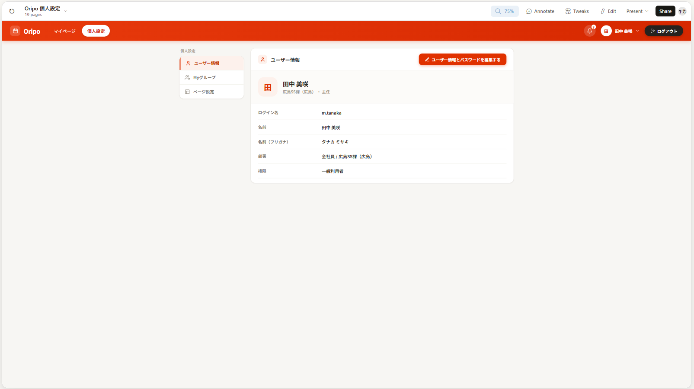
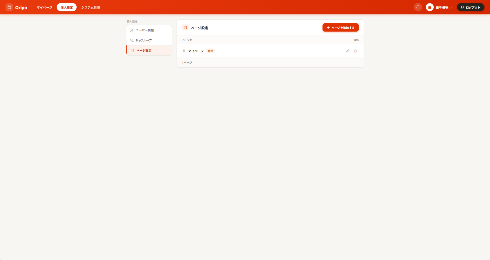

# 個人設定メニュー

## 概要

個人設定タブにてユーザー情報・Myグループ・ページ設定の3項目を切り替える。（AIPO の「個人設定」左側に表示される選択メニューに相当）
ヘッダーの「個人設定」タブを押すと、別ページに移動するのではなく画面の中身だけが切り替わる


| Issue | 内容 |
|---|---|
| #142 | 左の選択メニュー（本仕様書のスコープ） |
| #143 | ユーザー情報パネルの中身（別 Issue・未実装） |
| #144 | Myグループパネルの中身（別 Issue・未実装） |
| #145 | ページ設定パネルの中身（別 Issue・未実装） |

関連 Issue: #140（親: 個人設定画面）

---

## モックアップ

**デスクトップ:**





---

## 機能要件

### 左の選択メニュー

個人設定画面の左側に固定表示される選択メニュー。3つの項目を持ち、選択中の項目に応じて右側の
コンテンツエリアの表示を切り替える。

| 項目 | アイコン | デフォルト選択 |
|---|---|---|
| ユーザー情報 | 人物アイコン | ○（個人設定を開いた直後はこれを表示） |
| Myグループ | 人物×2アイコン | - |
| ページ設定 | パネルアイコン | - |


- メニュー上部に「個人設定」というグループ見出しを小さいグレー文字で表示する（モックアップ準拠）
- 選択中の項目はオレンジ背景・オレンジ左ボーダー・オレンジ文字（太字）でハイライトする
- 非選択の項目はグレー文字。ホバー時に薄いグレー背景を表示する
- 項目クリックでコンテンツエリアの表示のみ切り替える（URL 遷移なし、ページリロードなし）
- ヘッダーの「個人設定」タブを再度クリックしてマイページへ戻った後、再度「個人設定」タブを開くと
  選択状態はユーザー情報にリセットされる


### レスポンシブ対応

| ブレークポイント | 挙動 |
|---|---|
| デスクトップ（lg 以上） | 左メニュー（固定幅 144px）+ コンテンツエリアを横並び表示。コンテンツ幅は画面サイズに追従させる（モックアップは 1592px 幅での画面のため固定幅にすると広いモニタで窮屈になる。超ワイドモニタ対策として上限のみ設ける） |
| モバイル（lg 未満） | 左メニューをコンテンツ上部の横スクロール可能なピルボタン列として表示し、その下にコンテンツエリアを縦に表示する（モバイルモックアップ不在のため、既存のページタブと同様のピル UI に合わせた独自判断） |

---

## ファイル構成

```
src/app/(main)/_components/
  SettingsView.tsx  ← 個人設定画面全体（左メニュー + コンテンツエリアの状態管理）
  SettingsMenu.tsx  ← 左の選択メニュー（デスクトップ: 縦並び / モバイル: 横スクロールピル）
```

コンテンツエリアの中身（ユーザー情報・Myグループ・ページ設定の実データ表示・編集 UI）は
#143〜#145 で追加する。本 Issue では選択中の項目名のみを表示する。

---

## 受け入れ条件

- [ ] ヘッダーの「個人設定」タブをクリックすると左メニュー付きの個人設定画面が表示される
- [ ] 個人設定画面を開いた直後は「ユーザー情報」が選択された状態になっている
- [ ] 左メニューに「ユーザー情報」「Myグループ」「ページ設定」の3項目が表示される
- [ ] 選択中の項目はオレンジ背景・オレンジ左ボーダーでハイライトされる
- [ ] 「Myグループ」をクリックするとコンテンツエリアの表示が「Myグループ」に切り替わる
- [ ] 「ページ設定」をクリックするとコンテンツエリアの表示が「ページ設定」に切り替わる
- [ ] ヘッダーの「個人設定」タブを閉じてマイページへ戻り、再度開くとユーザー情報が選択された状態に戻る
- [ ] モバイル（375px）で左メニューが横スクロール可能なピルボタン列として表示される
- [ ] モバイルでメニュー項目をタップするとコンテンツエリアの表示が切り替わる
