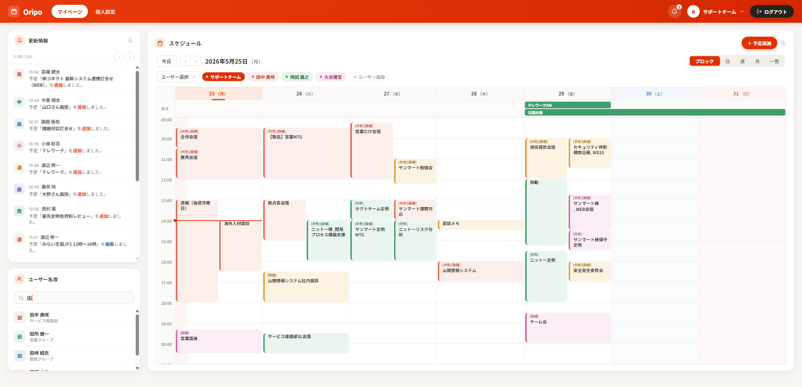

# ユーザー名簿ウィジェット

## 概要

ホーム画面に配置できるウィジェット。社内ユーザーを一覧表示し、氏名のキーワード検索ができる。
閲覧専用（編集は個人設定・ユーザー管理で行う）。

**このフェーズのスコープ:** ホームウィジェット（コンパクト版）のみ。
要件定義書 2.5 に記載の「部署・グループでの絞り込み」「ページング」は全件一覧ページ（別 Issue）で実装する。

関連 Issue: #83（ユーザー名簿コンポーネント）、#80（ホーム画面）

---

## モックアップ

**ホーム画面（左カラム）:**


---

## 機能要件

### ウィジェット表示

- ウィジェットヘッダー: 「ユーザー名簿」タイトル
- キーワード検索ボックス（氏名の部分一致）
- ユーザーリスト（スクロール可能）

### ユーザー詳細モーダル（クリック時）

ユーザー行をクリックするとモーダルで詳細を表示する（AIPO の UserDetailScreen 相当）。

**表示項目（要件定義書 2.5 準拠）:**
| 項目 | 取得元 |
|---|---|
| 氏名 | `last_name + first_name` |
| 氏名カナ | `last_name_kana + first_name_kana` |
| 部署 | `eip_m_post.post_name`（複数ある場合はすべて表示） |
| 携帯電話 | `turbine_user.cellular_phone` |

- 値が空の項目も行を表示する（空欄のまま表示）
- 役職・メール・外線・内線・写真は Oripo の管理対象外のため非表示

### ユーザーリスト

- 表示項目: イニシャルアイコン（色付き）、氏名、部署名、携帯電話番号（社内）
  - 電話番号の直接発信（`tel:` リンク）は今後の機能（要件定義書 2.5 参照）。今フェーズは表示のみ。
- ソート: 氏名カナ昇順（AIPO はデフォルト登録順だが、利便性のためカナ昇順に変更）
- disabled != 'T' のユーザーのみ表示（AIPO は 'T'=無効 / 'F'=有効の文字列フラグ。ログイン処理と同じ判定）
- キーワード検索: 入力中にリアルタイムでクライアント側フィルタ（最大約200名のため）
- 部署・グループでの絞り込みは全件一覧ページで実装（ウィジェットはキーワードのみ）
- ユーザー数が多い場合はリスト内スクロール（最大高さ制限）

### イニシャルアイコン

- 氏名（苗字）の先頭1文字を表示
- 背景色はユーザー ID を元に固定色パレット（8色）から Knuth 乗算ハッシュで割り当て（user_id が飛び番でも均一分布）
- 同じユーザーは常に同じ色になる

### データ取得

ユーザー + 部署の取得は以下の4テーブルJOINで行う:

```
turbine_user
  → turbine_user_group_role（user_id）
  → turbine_group（group_id）
  → eip_m_post（group_name = group_name）→ post_name（部署名）
```

- 1ユーザーが複数グループに所属する場合は `DISTINCT ON (user_id)` で重複を除去
- 役職（`eip_m_position`）は今フェーズでは取得しない（要件定義書に表示項目として未記載）

### レスポンシブ対応

| ブレークポイント | 挙動 |
|---|---|
| デスクトップ（lg 以上） | カラム内に収まるサイズ |
| モバイル（lg 未満） | 1列に強制表示（他ウィジェットと同様） |

---

## API

Server Action で実装（Route Handler は使わない）。

```ts
// src/app/(main)/actions.ts に追加
getUserListAction(): Promise<UserListUser[]>
getUserDetailAction(userId: number): Promise<UserListDetail | null>
```

### UserListUser 型

```ts
type UserListUser = {
  userId: number
  fullName: string      // "苗字 名前"
  fullNameKana: string  // "ナミョジ ナマエ"
  department: string | null
}
```

### UserListDetail 型

```ts
type UserListDetail = {
  userId: number
  fullName: string
  fullNameKana: string
  departments: string[]  // 複数部署対応
  position: string | null
  email: string | null
  outTelephone: string | null
  inTelephone: string | null
  cellularPhone: string | null
}
```

---

## データモデル

既存テーブルのみ使用（新規テーブル・マイグレーション不要）。

| テーブル | 用途 |
|---|---|
| `turbine_user` | ユーザー基本情報（氏名・カナ） |
| `turbine_user_group_role` | ユーザー↔グループ対応 |
| `turbine_group` | グループ（部署を含む） |
| `eip_m_post` | 部署マスタ（post_name が部署名） |

---

## ファイル構成

```
src/
  app/
    (main)/
      actions.ts                              ← getUserListAction / getUserDetailAction を追加
      _components/
        widgets/
          UserListWidget.tsx                  ← ウィジェット本体（'use client'）
          UserDetailModal.tsx                 ← ユーザー詳細モーダル（'use client'）
  lib/
    user-list.ts                              ← DBクエリ（getUserList / getUserDetail）
    user-list.utils.ts                        ← 純粋関数（getIconColor・filterUsers）Client Component から安全にインポートできる
    user-list.types.ts                        ← UserListUser / UserListDetail 型
    user-list.test.ts                         ← Vitestユニットテスト
```

> `user-list.utils.ts` を分離している理由: `user-list.ts` は `db` をインポートするため Client Component から直接 import すると `pg` → Node.js `fs` がクライアントバンドルに混入するエラーが発生する。純粋関数のみ別ファイルに切り出すことで回避している。

---

## 受け入れ条件

### ウィジェット
- [ ] ユーザー名簿ウィジェットがホーム画面に表示される
- [ ] disabled = 'T'（無効）のユーザーは表示されない（有効ユーザーは disabled != 'T'）
- [ ] 氏名カナ昇順でリスト表示される
- [ ] キーワード入力で氏名（漢字・カナ・ひらがな変換・部分一致）が絞り込まれる
- [ ] 各ユーザー行にイニシャルアイコン・氏名・部署名が表示される
- [ ] イニシャルアイコンの色はユーザーIDで固定（同一ユーザーは常に同じ色）
- [ ] モバイル（375px）で正常に表示・操作できる

### 詳細モーダル
- [ ] ユーザー行をクリックするとモーダルが開く
- [ ] モーダルに氏名・カナ・部署・役職・メール・電話番号が表示される
- [ ] 値が空の項目は行ごと表示されない
- [ ] 複数部署に所属しているユーザーはすべての部署が表示される
- [ ] モーダルを閉じるとリスト画面に戻る
